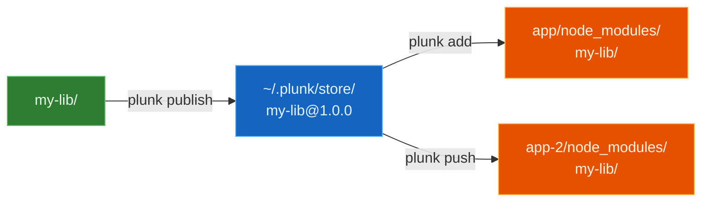

<p align="center">
  
</p>

<p align="center">
  <a href="https://www.npmjs.com/package/@olegkuibar/plunk"></a>
  <a href="https://www.npmjs.com/package/@olegkuibar/plunk"></a>
  <a href="https://github.com/oleg-kuibar/plunk/actions/workflows/ci.yml"></a>
  <a href="https://github.com/oleg-kuibar/plunk/blob/master/LICENSE"></a>
  <a href="https://www.npmjs.com/package/@olegkuibar/plunk"></a>
</p>

# plunk

Modern local package development tool. Smart file copying into `node_modules` — no symlinks, no git contamination.

```bash
npx plunk init       # set up your app
plunk add my-lib     # link a package
plunk push --watch   # continuous dev mode
```

## Why not symlinks?

`npm link` creates symlinks that break module resolution: duplicate React instances, peer dep mismatches, bundlers that can't follow links outside the project root. `yalc` improves on this but [still has issues](https://github.com/wclr/yalc/issues) with pnpm, git contamination, and watch mode.

**plunk** just copies built files directly into `node_modules/`. It works.

## How it works



1. `publish` copies built files to a local store at `~/.plunk/store/`
2. `add` copies from store into your app's `node_modules/`
3. `push` = publish + copy to all consumers
4. `--watch` = file change → build → push loop

> Uses CoW reflinks for instant copy-on-write on APFS/btrfs/ReFS, with automatic fallback. Reflink support is probed once per volume and cached — no wasted syscalls. Only changed files are re-copied (xxhash-based diffing).

## Quick start

```bash
# In your app — one-time setup
cd my-app
npx plunk init

# In your library — build and publish to plunk store
cd my-lib
pnpm build
plunk publish

# Back in your app — link the library
cd my-app
plunk add my-lib

# Continuous dev: watch → build → push
cd my-lib
plunk push --watch --build "pnpm build"
```

## At a glance

| | npm link | yalc | plunk |
|---|---|---|---|
| Module resolution | Broken (dual instances) | Works | Works |
| Git contamination | None | package.json + .yalc/ | None |
| Bundler HMR | Often broken | Fragile | Works |
| pnpm support | Fragile | Broken since v7.10 | Works |
| Watch mode | None | External | Built-in |
| Survives `npm install` | No | No | `plunk restore` |

## Install

```bash
pnpm add -g plunk       # or npm, yarn, bun
npx plunk init          # set up a consumer project
```

## Documentation

| | |
|---|---|
| [Getting Started](docs/getting-started.md) | Install, first publish/add cycle, watch mode |
| [Commands](docs/commands.md) | Every command, every flag |
| [How It Works](docs/how-it-works.md) | Store format, injection, CoW copies |
| [Bundler Guide](docs/bundlers.md) | Vite, Webpack, esbuild, Turbopack setup |
| [Comparison](docs/comparison.md) | npm link vs yalc vs plunk |
| [Examples](examples/) | Try it yourself with real packages |
| [Contributing](CONTRIBUTING.md) | Dev setup and guidelines |

## License

[MIT](LICENSE)
