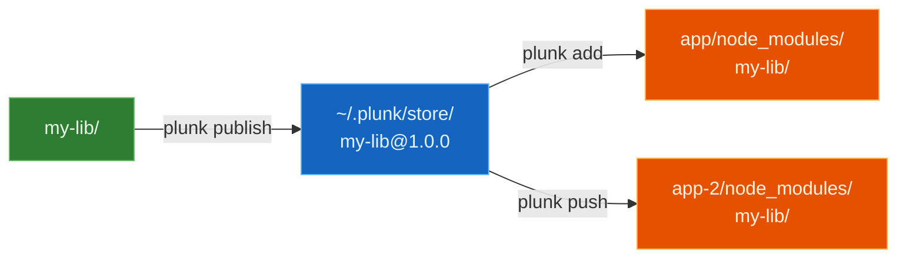

<p align="center">
  
</p>

<p align="center">
  <a href="https://plunk.olegkuibar.dev/"></a>
  <a href="https://www.npmjs.com/package/@olegkuibar/plunk"></a>
  <a href="https://www.npmjs.com/package/@olegkuibar/plunk"></a>
  <a href="https://www.npmjs.com/package/@olegkuibar/plunk"></a>
  <a href="https://github.com/oleg-kuibar/plunk/actions/workflows/ci.yml"></a>
  <a href="https://github.com/oleg-kuibar/plunk/blob/master/LICENSE"></a>
  
</p>

# plunk

Local npm package development without symlinks. Copies built files directly into consumer `node_modules/` with incremental sync, watch mode, and support for every package manager and bundler.

```bash
npx plunk init       # set up your app
plunk add my-lib     # link a package
plunk push --watch   # continuous dev mode
```

## Why plunk?

`npm link` creates symlinks that break module resolution — duplicate React instances, peer dep mismatches, bundlers that can't follow links outside the project root. Tools like [yalc](https://github.com/wclr/yalc) improved on this by copying files instead, but still modify `package.json` and lack built-in watch mode.

**plunk** copies built files directly into `node_modules/` without touching your `package.json` or lock file. Incremental sync (xxhash diffing + mtime fast-skip), built-in watch mode, and multi-consumer push make it practical for daily development across projects.

## How it works



1. `publish` copies built files to a local store at `~/.plunk/store/`
2. `add` copies from store into your app's `node_modules/`
3. `push` = publish + copy to all consumers
4. `--watch` = file change → build → push loop

> Uses CoW reflinks for instant copy-on-write on APFS/btrfs/ReFS, with automatic fallback. Reflink support is probed once per volume and cached — no wasted syscalls. Only changed files are re-copied (xxhash-based diffing).

## Quick start

```bash
# In your app — one-time setup
cd my-app
npx plunk init

# In your library — build and publish to plunk store
cd my-lib
pnpm build
plunk publish

# Back in your app — link the library
cd my-app
plunk add my-lib

# Continuous dev: watch → build → push
cd my-lib
plunk push --watch --build "pnpm build"
```

## At a glance

| | npm link | yalc | plunk |
|---|---|---|---|
| Mechanism | Symlinks | Copy + package.json rewrite | Copy only |
| Module resolution | Broken (dual instances) | Works | Works |
| Git contamination | None | package.json + .yalc/ | None |
| Bundler HMR | Often broken | Varies | Works |
| pnpm support | Fragile | Limited | Full |
| Watch mode | None | External | Built-in |
| Survives `npm install` | No | No | `plunk restore` |
| Incremental sync | N/A | Full copy each time | mtime + xxhash diff |

See [detailed comparison](docs/comparison.md) for a deeper breakdown.

## Install

```bash
pnpm add -g @olegkuibar/plunk       # or npm, yarn, bun
npx @olegkuibar/plunk init          # set up a consumer project
```

## Try it online

Experience plunk directly in your browser with our interactive playground:

**[Open Playground](https://plunk-playground.vercel.app)** — Run real `plunk publish`, `plunk add`, and `plunk push` commands with live HMR preview.

## Documentation

| | |
| --- | --- |
| [Getting Started](docs/getting-started.md) | Install, first publish/add cycle, watch mode |
| [Commands](docs/commands.md) | Every command, every flag |
| [How It Works](docs/how-it-works.md) | Store format, injection, CoW copies |
| [Bundler Guide](docs/bundlers.md) | Vite, Webpack, esbuild, Turbopack setup |
| [Comparison](docs/comparison.md) | npm link vs yalc vs plunk |
| [CI/CD](docs/ci-cd.md) | Using plunk in CI pipelines |
| [Monorepo Guide](docs/monorepo.md) | Workspace setup and recursive publish |
| [Troubleshooting](docs/troubleshooting.md) | Common issues and fixes |
| [FAQ](docs/faq.md) | Frequently asked questions |
| [Migrating from yalc](docs/migrating-from-yalc.md) | Step-by-step migration guide |
| [Architecture](docs/architecture.md) | Internals for contributors |
| [API Reference](docs/api.md) | Programmatic API (TypeScript) |
| [Examples](examples/) | Try it yourself with real packages |
| [Playground](playground/) | Interactive browser-based playground |
| [Contributing](CONTRIBUTING.md) | Dev setup and guidelines |

## License

[MIT](LICENSE)
