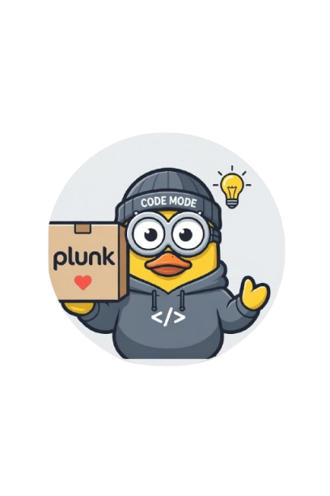
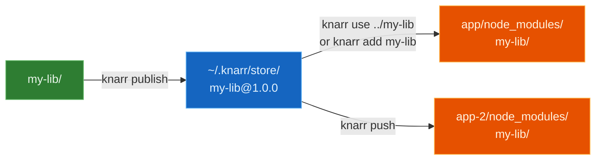

<p align="center">
  
</p>

<p align="center">
  <a href="https://knarr.olegkuibar.dev/"></a>
  <br>
  <a href="https://www.npmjs.com/package/knarr"></a>
  <a href="https://www.npmjs.com/package/knarr"></a>
  <a href="https://www.npmjs.com/package/knarr"></a>
  <a href="https://bundlephobia.com/package/knarr"></a>
  <br>
  <a href="https://github.com/oleg-kuibar/knarr/actions/workflows/ci.yml"></a>
  <a href="https://github.com/oleg-kuibar/knarr/blob/master/LICENSE"></a>
  
</p>

# Knarr

Test local npm packages in real apps without `npm link`, duplicate React, or dirty `package.json` diffs.

Knarr copies the built package output directly into the consumer app's `node_modules/`, so your package behaves like the version you would publish to npm. It works well with pnpm, Vite, Next.js, Webpack/rspack, Turbopack, and teams that want local package overrides to stay out of git.

```bash
cd my-app
npx knarr use ../my-lib

cd ../my-lib
knarr dev
```

If you have not installed Knarr globally, use `npx knarr dev` for the second command too.


## Who this is for

- Library and design-system authors testing packages inside real consumer apps
- React developers avoiding duplicate React instances and invalid hook calls from symlinks
- pnpm users where `npm link` or yalc do not match the installed dependency tree
- Teams that want clean git diffs while iterating on local packages

## Why Knarr?

`npm link` creates symlinks that can break module resolution: duplicate React instances, peer dependency mismatches, and bundlers that cannot follow links outside the project root. yalc improves this by copying files, but it rewrites consumer dependency specs and usually needs extra watch tooling.

Knarr keeps your `package.json` and lockfile clean. It publishes a local package into `~/.knarr/store/`, injects that package into every registered consumer, and can watch, rebuild, and push changes continuously.

## Quick Start

One command links a local package into the app you are testing:

```bash
# In your app
cd my-app
npx knarr use ../my-lib
```

Then run the continuous package dev loop from the library:

```bash
# In your library
cd ../my-lib
knarr dev
```

If Knarr is not installed globally, run `npx knarr dev` instead.

That is the everyday loop: edit `my-lib`, Knarr rebuilds it, pushes changed files into `my-app/node_modules/`, and your bundler sees the update.

If you prefer the explicit steps:

```bash
cd my-lib
pnpm build
knarr publish

cd ../my-app
knarr add my-lib
```

## How It Works


```mermaid
graph LR
    A["my-lib/"] -- "knarr publish" --> B["~/.knarr/store/<br/>my-lib@1.0.0"]
    B -- "knarr use ../my-lib<br/>or knarr add my-lib" --> C["app/node_modules/<br/>my-lib/"]
    B -- "knarr push" --> D["app-2/node_modules/<br/>my-lib/"]

    style A fill:#2e7d32,stroke:#66bb6a,color:#e8f5e9
    style B fill:#1565c0,stroke:#64b5f6,color:#e3f2fd
    style C fill:#e65100,stroke:#ffb74d,color:#fff3e0
    style D fill:#e65100,stroke:#ffb74d,color:#fff3e0
```

1. `publish` copies built files to a local store at `~/.knarr/store/`
2. `use` publishes from a local path and links it into the current app
3. `add` links an already-published package from the store
4. `push` publishes and copies to all registered consumers
5. `dev` watches, builds, publishes, and pushes continuously

## At A Glance

|                        | npm link                | yalc                        | Knarr               |
| ---------------------- | ----------------------- | --------------------------- | ------------------- |
| Mechanism              | Symlinks                | Copy + package.json rewrite | Copy only           |
| Module resolution      | Broken (dual instances) | Works                       | Works               |
| Git contamination      | None                    | package.json + .yalc/       | None                |
| Bundler HMR            | Often broken            | Varies                      | Works               |
| pnpm support           | Fragile                 | Limited                     | Full                |
| Watch mode             | None                    | External                    | Built-in            |
| Survives `npm install` | No                      | No                          | `knarr restore`     |
| Incremental sync       | N/A                     | Full copy each time         | mtime + xxhash diff |

See [detailed comparison](docs/comparison.md) for a deeper breakdown.

## Migrate From yalc In 60 Seconds

```bash
cd my-app
npx knarr migrate
npx knarr use ../my-lib

cd ../my-lib
knarr dev
```

See [Migrating from yalc](docs/migrating-from-yalc.md) for the full guide.

## Install

```bash
pnpm add -g knarr       # or npm, yarn, bun
npx knarr init          # one-off setup for a consumer project
```

## Performance Notes

knarr uses CoW reflinks for instant copy-on-write on APFS/btrfs/ReFS, with automatic fallback. Reflink support is probed once per volume and cached. Incremental sync checks size and mtime first, then falls back to xxhash only when needed, so unchanged files are skipped quickly.

## Try It Online

**[Open Playground](https://knarr.olegkuibar.dev)** - run `knarr publish`, `knarr add`, and `knarr push` in the browser with live HMR preview.

## Documentation

|                                                    |                                              |
| -------------------------------------------------- | -------------------------------------------- |
| [Getting Started](docs/getting-started.md)         | Install, first use/add cycle, watch mode     |
| [Commands](docs/commands.md)                       | Every command, every flag                    |
| [How It Works](docs/how-it-works.md)               | Store format, injection, CoW copies          |
| [Bundler Guide](docs/bundlers.md)                  | Vite, Webpack, esbuild, Turbopack setup      |
| [Comparison](docs/comparison.md)                   | npm link vs yalc vs Knarr                    |
| [CI/CD](docs/ci-cd.md)                             | Using Knarr in CI pipelines                  |
| [Monorepo Guide](docs/monorepo.md)                 | Workspace setup and recursive publish        |
| [Troubleshooting](docs/troubleshooting.md)         | Common issues and fixes                      |
| [FAQ](docs/faq.md)                                 | Frequently asked questions                   |
| [Migrating from yalc](docs/migrating-from-yalc.md) | Step-by-step migration guide                 |
| [Architecture](docs/architecture.md)               | Internals for contributors                   |
| [API Reference](docs/api.md)                       | Programmatic API (TypeScript)                |
| [Examples](examples/)                              | Try it yourself with real packages           |
| [Playground](playground/)                          | Interactive browser-based playground         |
| [Contributing](CONTRIBUTING.md)                    | Dev setup and guidelines                     |

## Acknowledgments

Knarr and its playground are built on top of excellent open-source projects:

- [chokidar](https://github.com/paulmillr/chokidar) - file watching
- [xxhash-wasm](https://github.com/nicolo-ribaudo/xxhash-wasm-legacy) - fast file hashing
- [citty](https://github.com/unjs/citty) - CLI framework
- [tsup](https://github.com/egoist/tsup) - TypeScript bundler
- [vitest](https://vitest.dev) - test runner
- [WebContainers](https://webcontainers.io) - in-browser Node.js runtime
- [Vite](https://vite.dev) - frontend tooling
- [React](https://react.dev) - UI framework
- [Monaco Editor](https://microsoft.github.io/monaco-editor/) - code editor
- [xterm.js](https://xtermjs.org) - terminal emulator
- [Tailwind CSS](https://tailwindcss.com) - styling

## License

[MIT](LICENSE)
