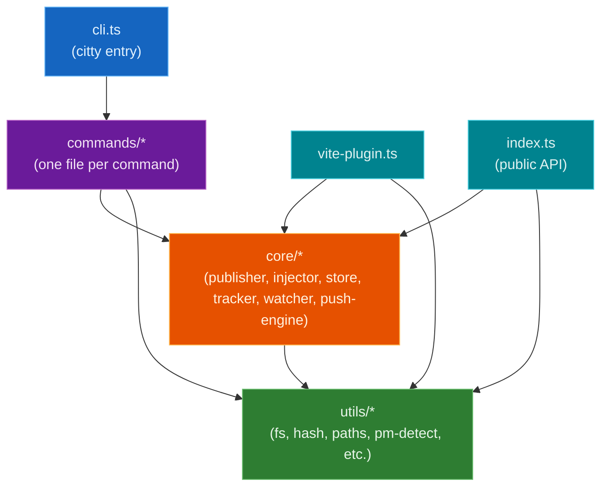

# Architecture

Contributor-facing internals. For user-facing explanations, see [How It Works](how-it-works.md).

## Module layers

Dependencies flow downward. No module imports from a layer above it.



## Data flow

### Publish

```
package.json → resolvePackFiles() → computeContentHash()
  → compare with store meta → copy files to temp dir
  → rewrite workspace:/catalog: versions → atomic rename to store
  → write .plunk-meta.json
```

Lifecycle hooks bracket the copy: `preplunk` → `prepack` → [copy] → `postpack` → `postplunk`.

### Inject

```
getStoreEntry() → resolve node_modules target (follow pnpm symlinks if needed)
  → backupExisting() → incrementalCopy() from store to node_modules
  → linkBinaries() → addLink() → registerConsumer()
```

### Push

```
publish() → getConsumers() → inject() to each consumer (parallel, limited to 4)
```

`doPush()` in `push-engine.ts` orchestrates the publish-then-inject-to-all-consumers sequence.

### Watch (dev mode)

```
chokidar watches src/lib/dist → debounce → run build cmd (if set)
  → doPush() → repeat
```

The watcher uses a "debounce effects, not detection" strategy: changes are detected immediately but coalesced. If new changes arrive during a push, it automatically re-pushes after the current one finishes.

## Concurrency and locking

| Mechanism | Where | What it protects |
|---|---|---|
| `withFileLock()` | `publisher.ts` | Prevents concurrent publishes of the same package from corrupting the store. Uses `mkdir` as an atomic lock primitive with exponential backoff and 60s stale detection. |
| `pLimit(cpuCount)` | `publisher.ts`, `hash.ts` | Limits parallel file copies and hash computations to CPU core count. |
| `pLimit(4)` | `push-engine.ts` | Limits parallel consumer injections to 4 to avoid saturating I/O. |

`pLimit` is a minimal reimplementation in `utils/concurrency.ts` (no external dependency).

## Hash strategy

| Hash | Algorithm | Use | Stored? |
|---|---|---|---|
| Per-file | xxHash64 (xxhash-wasm) | Incremental copy change detection (fallback when mtime differs) | No |
| Aggregate | SHA-256 | Content identity (`sha256v2:` prefix in `.plunk-meta.json`) | Yes |

xxHash64 is lazy-initialized as a WASM singleton. Files >1 MB use streaming to cap memory usage.

The `buildId` is `contentHash.slice(9, 17)` — the first 8 hex characters after the `sha256v2:` prefix.

## Key source files

| File | Purpose |
|---|---|
| `src/cli.ts` | citty CLI definition, command routing, global flags |
| `src/commands/*.ts` | One `defineCommand()` per file. Each command is default-exported. |
| `src/core/publisher.ts` | `publish()` — file resolution, hashing, atomic store write, lifecycle hooks, protocol rewriting |
| `src/core/injector.ts` | `inject()` — incremental copy from store to `node_modules/`, backup/restore, bin linking |
| `src/core/store.ts` | Store CRUD — `getStoreEntry()`, `findStoreEntry()`, `listStoreEntries()`, meta read/write |
| `src/core/tracker.ts` | Consumer state (`state.json`) and global registry (`consumers.json`) management |
| `src/core/watcher.ts` | chokidar watcher with debounce, build subprocess management |
| `src/core/push-engine.ts` | `doPush()` — publish + inject to all consumers. `resolveWatchConfig()` for build/watch setup. |
| `src/utils/hash.ts` | `computeContentHash()` (SHA-256 aggregate), `hashFile()` (xxHash64 per-file) |
| `src/utils/fs.ts` | `copyWithCoW()`, `incrementalCopy()`, `ensureDir()`, `isNodeError()` |
| `src/utils/pack-list.ts` | `resolvePackFiles()` — npm-pack-compatible file resolution from `files` field |
| `src/utils/pm-detect.ts` | `detectPackageManager()` — lockfile-based PM detection |
| `src/utils/lockfile.ts` | `withFileLock()` — directory-based lock with retry and stale detection |
| `src/utils/workspace.ts` | Workspace root detection, package enumeration, catalog parsing |
| `src/utils/concurrency.ts` | Minimal `pLimit()` reimplementation |
| `src/vite-plugin.ts` | Vite plugin that watches `.plunk/state.json` and triggers full reload |
| `src/index.ts` | Public API re-exports for programmatic usage |
| `src/types.ts` | Shared TypeScript interfaces (`PlunkMeta`, `StoreEntry`, `LinkEntry`, `ConsumerState`, etc.) |
