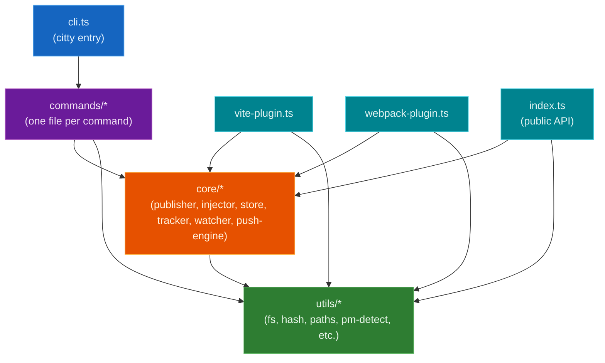

# Architecture

Contributor-facing internals. For user-facing explanations, see [How It Works](how-it-works.md).

## Module layers

Dependencies flow downward. No module imports from a layer above it.


```mermaid
graph TD
    CLI["cli.ts<br/>(citty entry)"] --> Commands["commands/*<br/>(one file per command)"]
    Commands --> Core["core/*<br/>(publisher, injector, store, tracker, watcher, push-engine)"]
    Core --> Utils["utils/*<br/>(fs, hash, paths, pm-detect, etc.)"]
    Commands --> Utils

    VitePlugin["vite-plugin.ts"] --> Core
    VitePlugin --> Utils

    WebpackPlugin["webpack-plugin.ts"] --> Core
    WebpackPlugin --> Utils

    IndexAPI["index.ts<br/>(public API)"] --> Core
    IndexAPI --> Utils

    style CLI fill:#1565c0,stroke:#64b5f6,color:#e3f2fd
    style Commands fill:#6a1b9a,stroke:#ba68c8,color:#f3e5f5
    style Core fill:#e65100,stroke:#ffb74d,color:#fff3e0
    style Utils fill:#2e7d32,stroke:#66bb6a,color:#e8f5e9
    style VitePlugin fill:#00838f,stroke:#4dd0e1,color:#e0f2f1
    style WebpackPlugin fill:#00838f,stroke:#4dd0e1,color:#e0f2f1
    style IndexAPI fill:#00838f,stroke:#4dd0e1,color:#e0f2f1
```

## Data flow

### Publish

```
package.json → resolvePackFiles() → computeContentHash()
  → compare with store meta → copy files to temp dir
  → rewrite workspace:/catalog: versions → atomic rename to store
  → write .knarr-meta.json
```

Lifecycle hooks bracket the copy: `preknarr` → `prepack` → [copy] → `postpack` → `postknarr`.

### Inject

```
getStoreEntry() → resolve node_modules target (follow pnpm symlinks if needed)
  → backupExisting() → incrementalCopy() from store to node_modules
  → linkBinaries() → addLink() → registerConsumer()
```

### Push

```
publish() → getConsumers() → inject() to each consumer (parallel, limited to 4)
```

`doPush()` in `push-engine.ts` orchestrates the publish-then-inject-to-all-consumers sequence.

### Watch (dev mode)

```
chokidar watches src/lib/dist → debounce → run build cmd (if set)
  → doPush() → repeat
```

The watcher uses a "debounce effects, not detection" strategy: changes are detected immediately but coalesced. If new changes arrive during a push, it automatically re-pushes after the current one finishes.

### Cascading rebuilds (`dev --all`)

```
WatchOrchestrator starts per-package watchers in topo order
  → package A changes → build + push A
  → lookup reverse adjacency → packages B, C depend on A
  → requestRebuild(B), requestRebuild(C) (pLimit(2))
  → build + push B → cascade to B's dependents → ...
```

State machine per package prevents infinite loops: `idle → building → idle` (normal), `building + trigger → queued → building` (coalesced), `queued + trigger → queued` (no-op). Disable with `--no-cascade`.

## Concurrency and locking

| Mechanism | Where | What it protects |
|---|---|---|
| `withFileLock()` | `publisher.ts` | Prevents concurrent publishes of the same package from corrupting the store. Uses `mkdir` as an atomic lock primitive with exponential backoff and 60s stale detection. |
| `pLimit(cpuCount)` | `publisher.ts`, `hash.ts` | Limits parallel file copies and hash computations to CPU core count. |
| `pLimit(4)` | `push-engine.ts` | Limits parallel consumer injections to 4 to avoid saturating I/O. |
| `pLimit(2)` | `watch-orchestrator.ts` | Limits concurrent cascade rebuilds to 2. |

`pLimit` is a minimal reimplementation in `utils/concurrency.ts` (no external dependency).

## Hash strategy

| Hash | Algorithm | Use | Stored? |
|---|---|---|---|
| Per-file | xxHash64 (xxhash-wasm) | Incremental copy change detection (fallback when mtime differs) | No |
| Aggregate | SHA-256 | Content identity (`sha256v2:` prefix in `.knarr-meta.json`) | Yes |

xxHash64 is lazy-initialized as a WASM singleton. Files >1 MB use streaming to cap memory usage.

The `buildId` is `contentHash.slice(9, 17)` — the first 8 hex characters after the `sha256v2:` prefix.

## Key source files

| File | Purpose |
|---|---|
| `src/cli.ts` | citty CLI definition, command routing, global flags |
| `src/commands/*.ts` | One `defineCommand()` per file. Each command is default-exported. |
| `src/core/publisher.ts` | `publish()` — file resolution, hashing, atomic store write, lifecycle hooks, protocol rewriting |
| `src/core/injector.ts` | `inject()` — incremental copy from store to `node_modules/`, backup/restore, bin linking |
| `src/core/store.ts` | Store CRUD — `getStoreEntry()`, `findStoreEntry()`, `listStoreEntries()`, meta read/write |
| `src/core/tracker.ts` | Consumer state (`state.json`) and global registry (`consumers.json`) management |
| `src/core/watcher.ts` | chokidar watcher with debounce, build subprocess management |
| `src/core/push-engine.ts` | `doPush()` — publish + inject to all consumers. `resolveWatchConfig()` for build/watch setup. |
| `src/core/batch-push.ts` | `doPushAll()` — workspace batch push in topological order |
| `src/core/watch-orchestrator.ts` | `WatchOrchestrator` — cascading rebuild orchestrator for `dev --all` |
| `src/core/history.ts` | Build history capture, list, restore, prune for `knarr rollback` |
| `src/utils/hash.ts` | `computeContentHash()` (SHA-256 aggregate), `hashFile()` (xxHash64 per-file) |
| `src/utils/fs.ts` | `copyWithCoW()`, `incrementalCopy()`, `ensureDir()`, `isNodeError()` |
| `src/utils/pack-list.ts` | `resolvePackFiles()` — npm-pack-compatible file resolution from `files` field |
| `src/utils/pm-detect.ts` | `detectPackageManager()` — lockfile-based PM detection |
| `src/utils/lockfile.ts` | `withFileLock()` — directory-based lock with retry and stale detection |
| `src/utils/workspace.ts` | Workspace root detection, package enumeration, catalog parsing, reverse adjacency |
| `src/utils/concurrency.ts` | Minimal `pLimit()` reimplementation |
| `src/utils/dry-run.ts` | Mutation recorder and summary reporter for `--dry-run` mode |
| `src/utils/preflight.ts` | Pre-flight validation (exports, types, entry points, bin paths) |
| `src/utils/config.ts` | `loadKnarrConfig()` — reads `package.json#knarr` config |
| `src/utils/topo-sort.ts` | `topoSort()` — Kahn's algorithm for workspace dependency ordering |
| `src/utils/vite-config.ts` | Auto-inject/remove Knarr Vite plugin (balanced bracket parser, complexity detector) |
| `src/utils/nextjs-config.ts` | Auto-add transpilePackages for Next.js (wrapper function detection) |
| `src/vite-plugin.ts` | Vite plugin that watches `.knarr/state.json` and triggers full reload |
| `src/webpack-plugin.ts` | Webpack/rspack plugin — excludes linked packages from snapshot cache, watches state.json |
| `src/index.ts` | Public API re-exports for programmatic usage |
| `src/types.ts` | Shared TypeScript interfaces (`KnarrMeta`, `StoreEntry`, `LinkEntry`, `ConsumerState`, etc.) |
