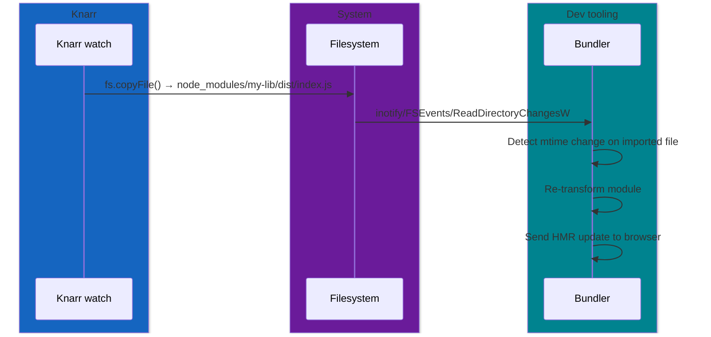
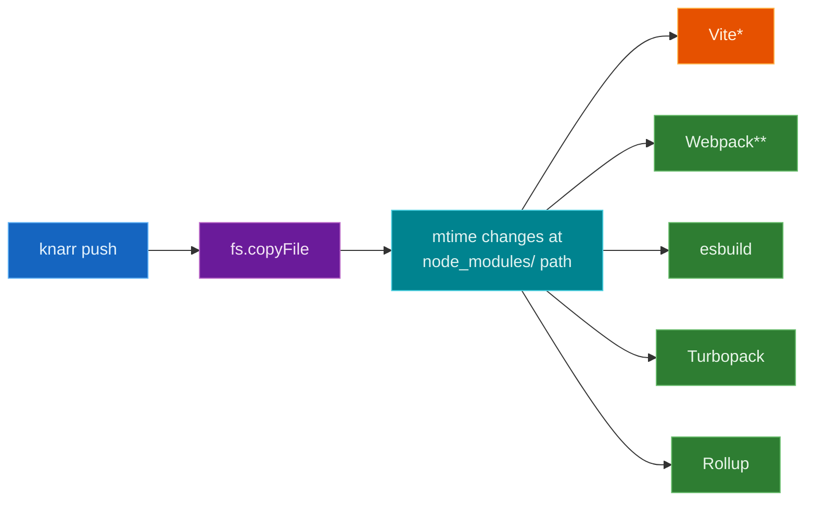

# Bundler guide

Since Knarr copies real files into `node_modules/`, bundler compatibility is mostly free. The one exception is Vite, which needs a config tweak.

## How detection works


```mermaid
sequenceDiagram
    box rgb(21,101,192) Knarr
        participant W as Knarr watch
    end
    box rgb(106,27,154) System
        participant FS as Filesystem
    end
    box rgb(0,131,143) Dev tooling
        participant B as Bundler
    end

    W->>FS: fs.copyFile() → node_modules/my-lib/dist/index.js
    FS->>B: inotify/FSEvents/ReadDirectoryChangesW
    B->>B: Detect mtime change on imported file
    B->>B: Re-transform module
    B->>B: Send HMR update to browser
```

When Knarr copies a file into `node_modules/`, it generates a real filesystem write event at that path. Bundlers watching imported files see the mtime change and rebuild.

## Vite

Vite pre-bundles dependencies with esbuild and caches the result. Changes to files in `node_modules/` won't be detected unless you tell Vite to skip pre-bundling for those packages.

### Vite plugin (auto-configured)

Knarr provides a Vite plugin that handles cache invalidation and dev server reloads automatically:

```ts
// vite.config.ts
import { defineConfig } from 'vite'
import knarr from 'knarr/vite'

export default defineConfig({
  plugins: [knarr()],
})
```

> **Auto-injection:** Both `knarr add` and `knarr init` automatically add the Knarr Vite plugin to your config when they detect Vite. `knarr remove` removes it when the last Knarr-linked package is unlinked. You typically don't need to add it manually.

### Why a plugin?

Vite pre-bundles dependencies into `.vite/deps/` and caches the result. The Knarr Vite plugin watches `.knarr/state.json` for changes and triggers a full reload when knarr pushes new files, ensuring the dev server always picks up the latest version.

### If changes aren't detected

Rare, but if the default filesystem watcher misses `node_modules` changes, fall back to polling:

```ts
export default defineConfig({
  server: {
    watch: {
      // Force polling (slower but guaranteed to work)
      usePolling: true,
      interval: 500,
    },
  },
  optimizeDeps: {
    exclude: ['my-lib'],
  },
})
```

You almost certainly don't need this.

## Tailwind CSS v4

Tailwind v4's Oxide scanner follows `.gitignore` rules, which means it skips `node_modules/` by default. When knarr pushes updated files into `node_modules/`, Tailwind won't see the new utility classes unless you explicitly register the package path with `@source`.

### Required setup

In your main CSS file, add an `@source` directive for each Knarr-linked package:

```css
@import "tailwindcss";
@source "../node_modules/@my-scope/my-pkg";
```

This tells Tailwind's scanner to walk that directory despite it being gitignored. Without it, classes used only in Knarr-linked packages will have no CSS rules.

> **Auto-injection:** `knarr add` automatically inserts the `@source` directive when it detects a Tailwind v4 CSS file (one containing `@import "tailwindcss"`). `knarr remove` cleans it up per-package. You typically don't need to add it manually.

### How it works

When knarr pushes and the Vite plugin detects the change, it:

1. Invalidates all CSS modules in Vite's module graph (clears cached transform results)
2. Clears the Vite disk cache
3. Sends a full-reload to the browser

On reload, Vite re-runs Tailwind's `transform` hook. The Oxide scanner incrementally re-walks all source directories (including `@source` paths), detects the new file mtimes from Knarr's injection, re-reads them, extracts the new utility candidates, and generates fresh CSS.

### Tailwind v3

Tailwind v3 uses a `content` array in `tailwind.config.js`. Add the package path there instead:

```js
module.exports = {
  content: [
    './src/**/*.{js,ts,jsx,tsx}',
    './node_modules/@my-scope/my-pkg/dist/**/*.js',
  ],
}
```

## Webpack

Webpack's `watchpack` detects mtime changes on every file it resolves, so basic rebuilds work automatically. For the best experience, use the Knarr webpack plugin:

### Webpack plugin (optional)

Knarr provides a webpack plugin that handles cache invalidation and rebuild triggering for webpack 5 and rspack:

```js
// webpack.config.js
const { KnarrWebpackPlugin } = require('knarr/webpack')

module.exports = {
  plugins: [new KnarrWebpackPlugin()],
}
```

```ts
// rspack.config.ts
import { KnarrWebpackPlugin } from 'knarr/webpack'

export default {
  plugins: [new KnarrWebpackPlugin()],
}
```

The plugin:

- Excludes linked package paths from webpack's `snapshot.managedPaths` so webpack doesn't cache them as "immutable node_modules"
- Watches `.knarr/state.json` and linked package directories for changes
- Calls `compiler.watching.invalidate()` on change (200ms debounce)
- Adds linked package directories as `contextDependencies` so webpack tracks them
- Falls back to polling in WebContainer environments (StackBlitz, etc.)

### Without the plugin

Without the plugin, webpack still detects mtime changes and rebuilds. However, if you use `cache: { type: 'filesystem' }`, webpack may cache linked packages as stable `node_modules` dependencies and miss updates. The plugin solves this by excluding linked packages from `snapshot.managedPaths`.

## esbuild

No config needed. esbuild's watch mode polls for mtime changes:

```bash
esbuild src/index.ts --bundle --watch
```

## Turbopack

No config needed. Turbopack restricts file watching to the project root, which is why `npm link` (symlinks pointing outside) breaks. Since Knarr copies files _inside_ `node_modules/`, Turbopack sees them.

## Rollup

No config needed. Watch mode picks up mtime changes on resolved files:

```bash
rollup -c --watch
```

## Summary


```mermaid
graph LR
    P[knarr push] --> FS[fs.copyFile]
    FS --> E1[mtime changes at<br/>node_modules/ path]
    E1 --> V[Vite*]
    E1 --> W[Webpack**]
    E1 --> ES[esbuild]
    E1 --> T[Turbopack]
    E1 --> R[Rollup]

    style P fill:#1565c0,stroke:#64b5f6,color:#e3f2fd
    style FS fill:#6a1b9a,stroke:#ba68c8,color:#f3e5f5
    style E1 fill:#00838f,stroke:#4dd0e1,color:#e0f2f1
    style V fill:#e65100,stroke:#ffb74d,color:#fff3e0
    style W fill:#2e7d32,stroke:#66bb6a,color:#e8f5e9
    style ES fill:#2e7d32,stroke:#66bb6a,color:#e8f5e9
    style T fill:#2e7d32,stroke:#66bb6a,color:#e8f5e9
    style R fill:#2e7d32,stroke:#66bb6a,color:#e8f5e9
```

*Vite requires the Knarr plugin (auto-injected by `knarr add`/`knarr init`). Webpack has an optional plugin for reliable cache invalidation. Everything else works without changes.*

| Bundler | Config needed | Why it works |
|---|---|---|
| Vite | Knarr plugin (auto-injected) | Plugin triggers reload on push |
| Webpack | Knarr plugin (optional) | Plugin handles cache invalidation; without it, watchpack detects mtime changes |
| rspack | Knarr plugin (optional) | Same plugin works with rspack |
| esbuild | None | Poll-based watch sees mtime changes |
| Turbopack | None | Files are inside project root |
| Rollup | None | Watch mode tracks resolved files |
