# Bundler guide

Since plunk copies real files into `node_modules/`, bundler compatibility is mostly free. The one exception is Vite, which needs a config tweak.

## How detection works

```mermaid
sequenceDiagram
    box rgb(21,101,192) plunk
        participant W as plunk watch
    end
    box rgb(106,27,154) System
        participant FS as Filesystem
    end
    box rgb(0,131,143) Dev tooling
        participant B as Bundler
    end

    W->>FS: fs.copyFile() → node_modules/my-lib/dist/index.js
    FS->>B: inotify/FSEvents/ReadDirectoryChangesW
    B->>B: Detect mtime change on imported file
    B->>B: Re-transform module
    B->>B: Send HMR update to browser
```



When plunk copies a file into `node_modules/`, it generates a real filesystem write event at that path. Bundlers watching imported files see the mtime change and rebuild.

## Vite

Vite pre-bundles dependencies with esbuild and caches the result. Changes to files in `node_modules/` won't be detected unless you tell Vite to skip pre-bundling for those packages.

### Vite plugin (auto-configured)

plunk provides a Vite plugin that handles cache invalidation and dev server reloads automatically:

```ts
// vite.config.ts
import { defineConfig } from 'vite'
import plunk from '@papoy/plunk/vite'

export default defineConfig({
  plugins: [plunk()],
})
```

> **Auto-injection:** Both `plunk add` and `plunk init` automatically add the plunk Vite plugin to your config when they detect Vite. `plunk remove` removes it when the last plunk-linked package is unlinked. You typically don't need to add it manually.

### Why a plugin?

Vite pre-bundles dependencies into `.vite/deps/` and caches the result. The plunk Vite plugin watches `.plunk/state.json` for changes and triggers a full reload when plunk pushes new files, ensuring the dev server always picks up the latest version.

### If changes aren't detected

Rare, but if the default filesystem watcher misses `node_modules` changes, fall back to polling:

```ts
export default defineConfig({
  server: {
    watch: {
      // Force polling (slower but guaranteed to work)
      usePolling: true,
      interval: 500,
    },
  },
  optimizeDeps: {
    exclude: ['my-lib'],
  },
})
```

You almost certainly don't need this.

## Tailwind CSS v4

Tailwind v4's Oxide scanner follows `.gitignore` rules, which means it skips `node_modules/` by default. When plunk pushes updated files into `node_modules/`, Tailwind won't see the new utility classes unless you explicitly register the package path with `@source`.

### Required setup

In your main CSS file, add an `@source` directive for each plunk-linked package:

```css
@import "tailwindcss";
@source "../node_modules/@my-scope/my-pkg";
```

This tells Tailwind's scanner to walk that directory despite it being gitignored. Without it, classes used only in plunk-linked packages will have no CSS rules.

> **Auto-injection:** `plunk add` automatically inserts the `@source` directive when it detects a Tailwind v4 CSS file (one containing `@import "tailwindcss"`). `plunk remove` cleans it up per-package. You typically don't need to add it manually.

### How it works

When plunk pushes and the Vite plugin detects the change, it:

1. Invalidates all CSS modules in Vite's module graph (clears cached transform results)
2. Clears the Vite disk cache
3. Sends a full-reload to the browser

On reload, Vite re-runs Tailwind's `transform` hook. The Oxide scanner incrementally re-walks all source directories (including `@source` paths), detects the new file mtimes from plunk's injection, re-reads them, extracts the new utility candidates, and generates fresh CSS.

### Tailwind v3

Tailwind v3 uses a `content` array in `tailwind.config.js`. Add the package path there instead:

```js
module.exports = {
  content: [
    './src/**/*.{js,ts,jsx,tsx}',
    './node_modules/@my-scope/my-pkg/dist/**/*.js',
  ],
}
```

## Webpack

No config needed. Webpack's `watchpack` detects mtime changes on every file it resolves. When plunk updates a file in `node_modules/`, the mtime change triggers a recompilation.

If you use `cache: { type: 'filesystem' }`, the cache invalidates correctly because plunk only overwrites files whose content actually changed.

## esbuild

No config needed. esbuild's watch mode polls for mtime changes:

```bash
esbuild src/index.ts --bundle --watch
```

## Turbopack

No config needed. Turbopack restricts file watching to the project root, which is why `npm link` (symlinks pointing outside) breaks. Since plunk copies files _inside_ `node_modules/`, Turbopack sees them.

## Rollup

No config needed. Watch mode picks up mtime changes on resolved files:

```bash
rollup -c --watch
```

## Summary


*Vite requires the plunk plugin (auto-injected by `plunk add`/`plunk init`). Everything else works without changes.*

| Bundler | Config needed | Why it works |
|---|---|---|
| Vite | plunk plugin (auto-injected) | Plugin triggers reload on push |
| Webpack | None | watchpack detects mtime changes |
| esbuild | None | Poll-based watch sees mtime changes |
| Turbopack | None | Files are inside project root |
| Rollup | None | Watch mode tracks resolved files |
