# Bundler guide

Since plunk copies real files into `node_modules/`, bundler compatibility is mostly free. The one exception is Vite, which needs a config tweak.

## How detection works

```mermaid
sequenceDiagram
    box rgb(187,222,251) plunk
        participant W as plunk watch
    end
    box rgb(225,190,231) System
        participant FS as Filesystem
    end
    box rgb(178,235,242) Dev tooling
        participant B as Bundler
    end

    W->>FS: fs.copyFile() → node_modules/my-lib/dist/index.js
    FS->>B: inotify/FSEvents/ReadDirectoryChangesW
    B->>B: Detect mtime change on imported file
    B->>B: Re-transform module
    B->>B: Send HMR update to browser
```



When plunk copies a file into `node_modules/`, it generates a real filesystem write event at that path. Bundlers watching imported files see the mtime change and rebuild.

## Vite

Vite pre-bundles dependencies with esbuild and caches the result. Changes to files in `node_modules/` won't be detected unless you tell Vite to skip pre-bundling for those packages.

### Config (required)

```ts
// vite.config.ts
import { defineConfig } from 'vite'

export default defineConfig({
  optimizeDeps: {
    exclude: ['my-lib', '@scope/other-lib'],
  },
})
```

> `plunk add` automatically adds packages to `optimizeDeps.exclude` when it detects a Vite config. `plunk remove` removes them. You can also run `plunk init` to set up the section ahead of time.

### Why?

Without `exclude`, Vite pre-bundles `my-lib` into `.vite/deps/` on first load, caches it, and never re-reads `node_modules/my-lib/` again. With `exclude`, Vite reads the files directly on each import, so it notices when plunk overwrites them.

### If changes aren't detected

Rare, but if the default filesystem watcher misses `node_modules` changes, fall back to polling:

```ts
export default defineConfig({
  server: {
    watch: {
      // Force polling (slower but guaranteed to work)
      usePolling: true,
      interval: 500,
    },
  },
  optimizeDeps: {
    exclude: ['my-lib'],
  },
})
```

You almost certainly don't need this.

## Webpack

No config needed. Webpack's `watchpack` detects mtime changes on every file it resolves. When plunk updates a file in `node_modules/`, the mtime change triggers a recompilation.

If you use `cache: { type: 'filesystem' }`, the cache invalidates correctly because plunk only overwrites files whose content actually changed.

## esbuild

No config needed. esbuild's watch mode polls for mtime changes:

```bash
esbuild src/index.ts --bundle --watch
```

## Turbopack

No config needed. Turbopack restricts file watching to the project root, which is why `npm link` (symlinks pointing outside) breaks. Since plunk copies files _inside_ `node_modules/`, Turbopack sees them.

## Rollup

No config needed. Watch mode picks up mtime changes on resolved files:

```bash
rollup -c --watch
```

## Summary


*Vite requires `optimizeDeps.exclude` config. Everything else works without changes.*

| Bundler | Config needed | Why it works |
|---|---|---|
| Vite | `optimizeDeps.exclude` | Bypasses pre-bundle cache |
| Webpack | None | watchpack detects mtime changes |
| esbuild | None | Poll-based watch sees mtime changes |
| Turbopack | None | Files are inside project root |
| Rollup | None | Watch mode tracks resolved files |
