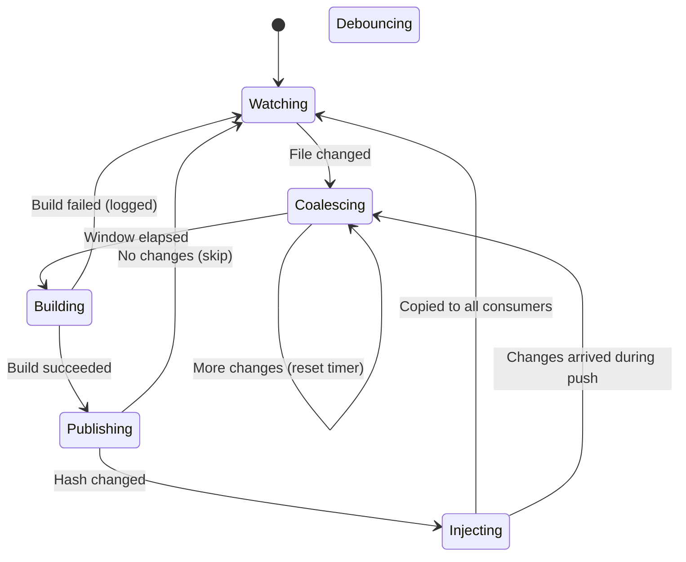

# Commands

## `plunk init`

Set up plunk in the current project. Interactive — detects your package manager and bundler, and auto-configures where possible. Idempotent, safe to run repeatedly.

```bash
npx plunk init
```

What it does:

1. **Detects package manager** from lockfiles (pnpm, bun, yarn, npm) and confirms with you
2. **Adds `.plunk/` to `.gitignore`**
3. **Wires up `"postinstall": "plunk restore || true"`** in `package.json`
4. **Creates `.plunk/` state directory** and stores the confirmed package manager
5. **Detects bundler** — if Vite, auto-injects the plunk Vite plugin into your config. Other bundlers (Webpack, Turbopack, etc.) need no config.

Flags:

| Flag | Description |
|---|---|
| `-y, --yes` | Skip confirmation prompts, use detected defaults |

---

## `plunk publish [dir]`

Publish a package to the local plunk store (`~/.plunk/store/`).

```bash
plunk publish              # publish current directory
plunk publish ../my-lib    # publish from a path
plunk publish --private    # allow private packages
```

Reads the `files` field from `package.json` to determine what to include (same logic as `npm pack`). Computes a content hash — if nothing changed since the last publish, it skips instantly.

Flags:

| Flag | Description |
|---|---|
| `--private` | Allow publishing packages with `"private": true` in package.json |

Included files:

- Files listed in the `files` field of `package.json`
- Always: `package.json`, `README`, `LICENSE`/`LICENCE`, `CHANGELOG`
- `.npmignore` exclusions apply
- `workspace:*` protocol versions get rewritten to real versions in the store copy (source is untouched)

---

## `plunk add <package>`

Link a package from the store into the current project's `node_modules/`.

```bash
plunk add my-lib
plunk add @scope/my-lib --from ../my-lib   # publish + add in one step
```

Flags:

| Flag | Description |
|---|---|
| `--from <path>` | Path to package source — publishes first, then links |
| `-y, --yes` | Auto-accept prompts (install missing deps without asking) |

Under the hood:

1. **Auto-initializes** the consumer if `.plunk/state.json` is missing (creates state, adds `.plunk/` to `.gitignore`, wires up `postinstall` hook) — no need to run `plunk init` first
2. Detects your package manager from lockfiles
3. Backs up the existing npm-installed version to `.plunk/backups/`
4. Copies files from store into `node_modules/`
5. Creates `.bin/` entries if the package has a `bin` field
6. Records the link in `.plunk/state.json` and `~/.plunk/consumers.json`
7. **Prompts to install** missing transitive dependencies (use `--yes` to auto-install)
8. **Auto-injects** the plunk Vite plugin into your Vite config if detected

---

## `plunk push`

Publish and copy to all consumers that have this package linked.

```bash
plunk push                                      # one-time push
plunk push --watch                              # watch mode, auto-detects build command
plunk push --watch --build "npx tsup"           # explicit build command
plunk push --watch --skip-build                 # watch output dirs directly
plunk push --watch --build "tsc" --debounce 500
```

Flags:

| Flag | Description |
|---|---|
| `--watch` | Watch for file changes and auto-push |
| `--build <cmd>` | Build command to run before publishing (watch mode) |
| `--skip-build` | Watch output dirs directly, skip build command detection |
| `--debounce <ms>` | Coalesce delay in milliseconds (default: `100`) |

Without `--watch`, it runs once: publish, then copy changed files to all consumers.

With `--watch`, it runs continuously using a "debounce effects, not detection" strategy: file changes are detected immediately, then coalesced — rapid saves within the debounce window collapse into a single push. If new changes arrive while a push is in progress, plunk automatically re-pushes after it finishes so the final state is always pushed.

**Build command auto-detection:** When no `--build` command is specified and `--skip-build` is not set, plunk auto-detects the build command from `package.json` scripts (checks `build`, `compile`, `bundle`, `tsc` in order). If no build script is found, the watcher monitors paths from the `files` field (typically `dist/`). With a build command, it watches source directories (`src/`, `lib/`, `dist/`). Build failures get logged but don't kill the watcher.

When watching output dirs directly (no build command), `awaitWriteFinish` is auto-enabled (200ms stability threshold) to avoid triggering on partially-written files.



---

## `plunk dev`

Watch, rebuild, and push to all consumers. This is the recommended command for library development — equivalent to `plunk push --watch` with auto-detected build command.

```bash
cd my-lib
plunk dev                              # auto-detects build command, enters watch mode
plunk dev --build "npx tsup"           # explicit build command
plunk dev --skip-build                 # watch output dirs directly
plunk dev --debounce 500               # custom coalesce delay
```

Flags:

| Flag | Description |
|---|---|
| `--build <cmd>` | Override build command (default: auto-detect from package.json) |
| `--skip-build` | Watch output dirs directly, skip build command detection |
| `--debounce <ms>` | Coalesce delay in milliseconds (default: `100`) |

On startup, `plunk dev`:

1. Auto-detects the build command from `package.json` scripts (`build`, `compile`, `bundle`, `tsc`)
2. Runs an initial publish + push to all consumers
3. Starts watching for file changes
4. On each change: coalesce → build → publish → push to all consumers

This is the ideal workflow for library authors:

```bash
# One-time setup:
cd my-lib && plunk dev

# In another terminal:
cd my-app && plunk add my-lib --from ../my-lib
pnpm dev
```

Then just edit files in `my-lib` — the build, publish, and push happen automatically.

---

## `plunk remove <package>`

Remove a plunk link and restore the original npm-installed version.

```bash
plunk remove my-lib
plunk remove @scope/my-lib
```

Removes injected files from `node_modules/` and cleans up `.bin/` entries. Restores the backup (original npm-installed version) if one exists. Also removes the package from `transpilePackages` in next.config and cleans up tracking state. If this was the last plunk-linked package, removes the plunk Vite plugin from your Vite config.

---

## `plunk restore`

Re-inject all linked packages after `npm install` wipes your overrides.

```bash
pnpm install      # whoops, plunk links gone
plunk restore     # all back
```

Flags:

| Flag | Description |
|---|---|
| `--silent` | Suppress output when no packages are linked (used by postinstall hook) |

Reads `.plunk/state.json` and re-copies each linked package from the store. Missing store entries get a warning but don't stop the rest.

---

## `plunk list`

Show linked packages.

```bash
plunk list          # linked packages in current project
plunk list --store  # all packages in the global store
```

Flags:

| Flag | Description |
|---|---|
| `--store` | List all packages in `~/.plunk/store/` instead of project links |

Project mode shows name, version, and source path. Store mode adds publish time.

---

## `plunk status`

Check whether linked packages are healthy.

```bash
plunk status
```

For each linked package, checks that the store entry exists, the content hash still matches, and the files are present in `node_modules/`. Tells you what to do if something is off.

---

## `plunk update [package]`

Pull the latest versions from the store for linked packages.

```bash
plunk update              # update all linked packages
plunk update my-lib       # update a specific package
```

For each linked package, checks if the store has a newer content hash. If so, re-injects the updated files into `node_modules/`. Packages already up to date are skipped.

Useful when another tool or teammate has published to the store, and you want to pull the changes without re-running `plunk add`.

---

## `plunk clean`

Remove unreferenced store entries and stale consumer registrations. Also available as `plunk gc`.

```bash
plunk clean
plunk gc          # alias for plunk clean
```

Performs two cleanup passes:

1. **Stale consumers** — removes entries in `~/.plunk/consumers.json` that point to directories that no longer exist on disk.
2. **Unreferenced store entries** — removes packages from `~/.plunk/store/` that are not linked by any active consumer.

Safe to run at any time. Does not affect packages that are actively linked.

---

## `plunk doctor`

Run diagnostic checks on your plunk setup.

```bash
plunk doctor
```

Checks performed:

| Check | What it verifies |
|---|---|
| Store directory | Exists and reports entry count |
| Global registry | `consumers.json` exists and reports registration count |
| Consumer state | `.plunk/state.json` has linked packages |
| Store entries | Each linked package has a matching store entry |
| Content hash | Store and consumer hashes are in sync |
| node_modules | Linked packages are present in `node_modules/` |
| Package manager | Detected from lockfile |
| Bundler | Detected from config files |
| .gitignore | `.plunk/` is listed |

Each check reports PASS, WARN, or FAIL with an actionable message. Use `--json` for machine-readable output.

---

## `plunk migrate`

Migrate from yalc to plunk.

```bash
plunk migrate
```

Detects yalc usage in the current project and cleans it up:

1. Reads `yalc.lock` to identify previously linked packages
2. Removes `file:.yalc/` references from `package.json`
3. Deletes the `.yalc/` directory
4. Deletes `yalc.lock`
5. Prints next steps (`plunk init`, `plunk add`)

If no yalc usage is detected, it exits without changes. See [Migrating from yalc](migrating-from-yalc.md) for a full guide.

---

## Global flags

These flags can be passed to any plunk command:

| Flag | Alias | Description |
|---|---|---|
| `--verbose` | `-v` | Enable verbose debug logging. Logs file hashes, symlink resolution, store operations, and timing. |
| `--dry-run` | | Preview changes without writing files. |
| `--json` | | Output machine-readable JSON to stdout. Suppresses human-readable log output. |

Examples:

```bash
plunk push --verbose              # detailed debug output
plunk publish --dry-run           # preview without writing
plunk status --json               # structured output for scripts
plunk push --json --verbose 2>debug.log   # JSON to stdout, debug logs to stderr
```

When `--json` is active, structured output goes to stdout and all human-readable messages from consola are suppressed. Verbose logs (when combined with `--json`) still go to stderr, so you can capture them separately.

---

## Environment

| Variable | Description |
|---|---|
| `PLUNK_HOME` | Override the store location (default: `~/.plunk/`) |

```bash
PLUNK_HOME=/tmp/my-store plunk publish
```
