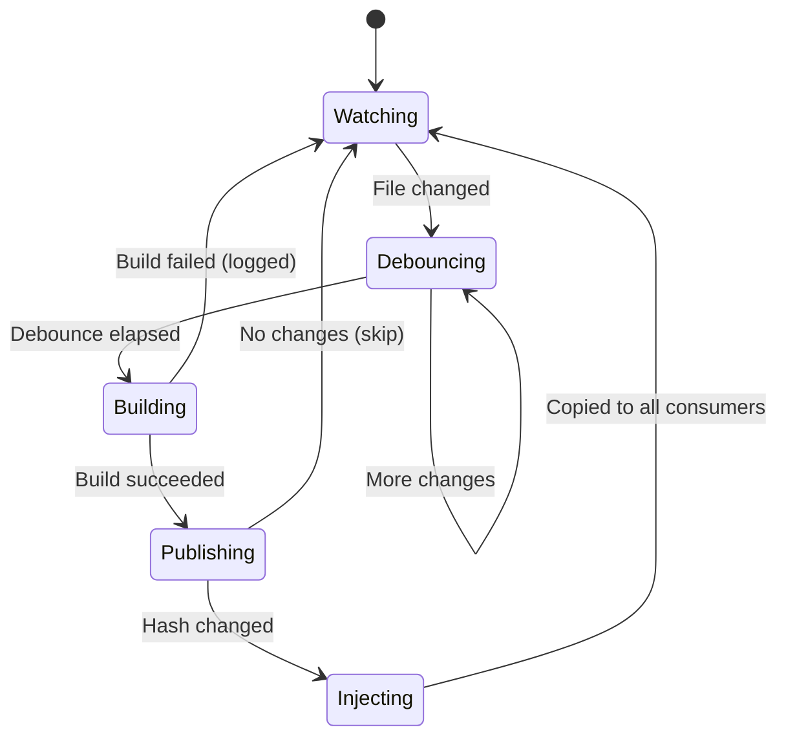

# Commands

## `plunk init`

Set up plunk in the current project. Idempotent, safe to run repeatedly.

```bash
npx plunk init
```

Adds `.plunk/` to `.gitignore`, wires up `"postinstall": "plunk restore || true"` in `package.json`, and creates the `.plunk/` state directory.

Flags:

| Flag | Description |
|---|---|
| `-y, --yes` | Skip confirmation prompts |

---

## `plunk publish [dir]`

Publish a package to the local plunk store (`~/.plunk/store/`).

```bash
plunk publish              # publish current directory
plunk publish ../my-lib    # publish from a path
```

Reads the `files` field from `package.json` to determine what to include (same logic as `npm pack`). Computes a content hash — if nothing changed since the last publish, it skips instantly.

Included files:

- Files listed in the `files` field of `package.json`
- Always: `package.json`, `README`, `LICENSE`/`LICENCE`, `CHANGELOG`
- `.npmignore` exclusions apply
- `workspace:*` protocol versions get rewritten to real versions in the store copy (source is untouched)

---

## `plunk add <package>`

Link a package from the store into the current project's `node_modules/`.

```bash
plunk add my-lib
plunk add @scope/my-lib --from ../my-lib   # publish + add in one step
```

Flags:

| Flag | Description |
|---|---|
| `--from <path>` | Path to package source — publishes first, then links |

Under the hood:

1. Detects your package manager from lockfiles
2. Backs up the existing npm-installed version to `.plunk/backups/`
3. Copies files from store into `node_modules/`
4. Creates `.bin/` entries if the package has a `bin` field
5. Records the link in `.plunk/state.json` and `~/.plunk/consumers.json`
6. Warns if the linked package has dependencies missing from the consumer
7. Prints a Vite `optimizeDeps.exclude` hint if it sees a vite config

---

## `plunk push`

Publish and copy to all consumers that have this package linked.

```bash
plunk push                                      # one-time push
plunk push --watch --build "npx tsup"           # continuous dev mode
plunk push --watch --build "tsc" --debounce 500
```

Flags:

| Flag | Description |
|---|---|
| `--watch` | Watch for file changes and auto-push |
| `--build <cmd>` | Build command to run before publishing (watch mode) |
| `--debounce <ms>` | Debounce delay in milliseconds (default: `300`) |

Without `--watch`, it runs once: publish, then copy changed files to all consumers.

With `--watch`, it runs continuously: file change → debounce → build → publish → copy. Build failures get logged but don't kill the watcher.



---

## `plunk remove <package>`

Remove a plunk link and restore the original npm-installed version.

```bash
plunk remove my-lib
plunk remove @scope/my-lib
```

Removes injected files from `node_modules/`, cleans up `.bin/` entries, restores the backup (original npm-installed version) if one exists, and removes tracking state.

---

## `plunk restore`

Re-inject all linked packages after `npm install` wipes your overrides.

```bash
npm install       # whoops, plunk links gone
plunk restore     # all back
```

Flags:

| Flag | Description |
|---|---|
| `--silent` | Suppress output when no packages are linked (used by postinstall hook) |

Reads `.plunk/state.json` and re-copies each linked package from the store. Missing store entries get a warning but don't stop the rest.

---

## `plunk list`

Show linked packages.

```bash
plunk list          # linked packages in current project
plunk list --store  # all packages in the global store
```

Flags:

| Flag | Description |
|---|---|
| `--store` | List all packages in `~/.plunk/store/` instead of project links |

Project mode shows name, version, and source path. Store mode adds publish time.

---

## `plunk status`

Check whether linked packages are healthy.

```bash
plunk status
```

For each linked package, checks that the store entry exists, the content hash still matches, and the files are present in `node_modules/`. Tells you what to do if something is off.

---

## Environment

| Variable | Description |
|---|---|
| `PLUNK_HOME` | Override the store location (default: `~/.plunk/`) |

```bash
PLUNK_HOME=/tmp/my-store plunk publish
```
