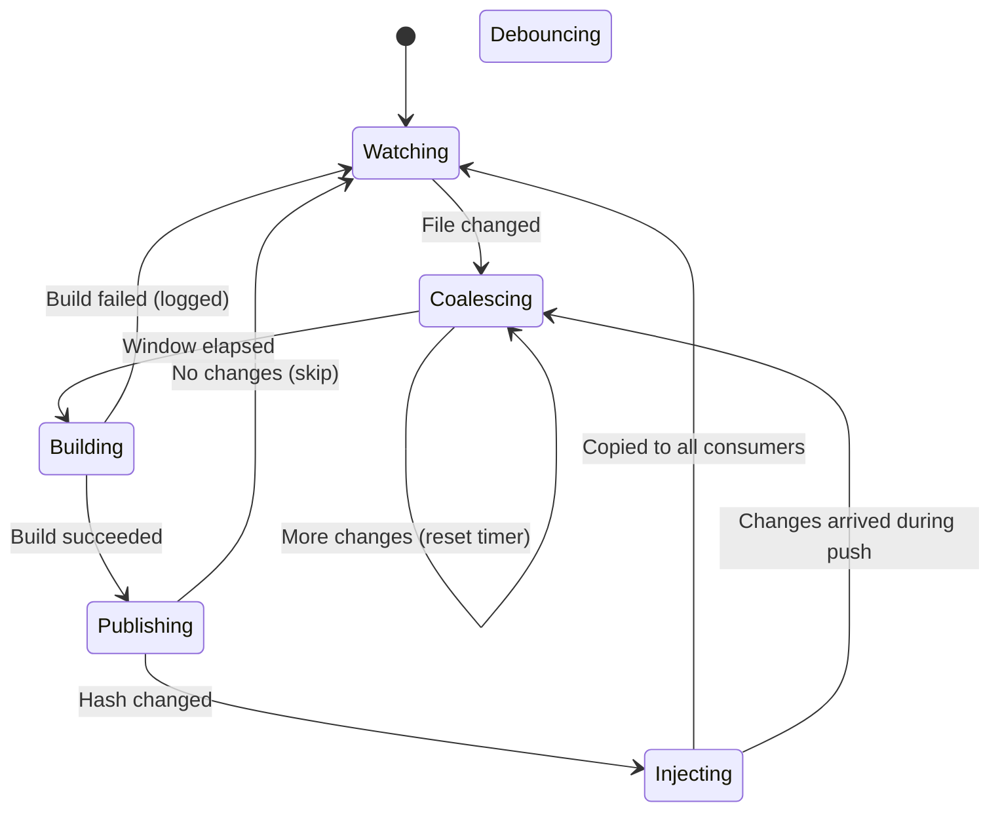

# Commands

## `knarr init`

Set up Knarr in the current project. Interactive — detects your package manager and bundler, and auto-configures where possible. Idempotent, safe to run repeatedly.

```bash
npx knarr init
```

What it does:

1. **Detects package manager** from lockfiles (pnpm, bun, yarn, npm) and confirms with you
2. **Adds `.knarr/` to `.gitignore`**
3. **Wires up `"postinstall": "knarr restore || true"`** in `package.json`
4. **Creates `.knarr/` state directory** and stores the confirmed package manager
5. **Detects bundler** — if Vite, auto-injects the Knarr Vite plugin into your config. Other bundlers (Webpack, Turbopack, etc.) need no config.

Flags:

| Flag | Description |
|---|---|
| `-y, --yes` | Skip confirmation prompts, use detected defaults |
| `--role <role>` | Project role: `"consumer"` or `"library"` |

---

## `knarr use <path>`

Publish a local package directory and link it into the current project in one step.

```bash
cd my-app
npx knarr use ../my-lib
knarr use ../packages/ui-kit
```

`use` reads `<path>/package.json`, infers the package name, publishes that package to the Knarr store, auto-initializes the current consumer if needed, and injects the package into `node_modules/`.

This is the recommended first-run workflow. It is equivalent to:

```bash
cd ../my-lib
knarr publish

cd ../my-app
knarr add my-lib
```

Flags:

| Flag | Description |
|---|---|
| `-y, --yes` | Auto-accept prompts (install missing deps, etc.) |

---

## `knarr publish [dir]`

Publish a package to the local Knarr store (`~/.knarr/store/`).

```bash
knarr publish              # publish current directory
knarr publish ../my-lib    # publish from a path
knarr publish --private    # allow private packages
```

Reads the `files` field from `package.json` to determine what to include (same logic as `npm pack`). Computes a content hash — if nothing changed since the last publish, it skips instantly.

Flags:

| Flag | Description |
|---|---|
| `--private` | Allow publishing packages with `"private": true` in package.json |
| `--no-scripts` | Skip `prepack`/`postpack` lifecycle hooks |
| `-r, --recursive` | Publish all packages in the workspace |
| `--no-check` | Skip pre-flight validation checks |

Included files:

- Files listed in the `files` field of `package.json`
- Always: `package.json`, `README`, `LICENSE`/`LICENCE`, `CHANGELOG`
- `.npmignore` exclusions apply
- `workspace:*` and `catalog:` protocol versions get rewritten to real versions in the store copy (source is untouched)
- When `publishConfig.directory` is set, files are read from that subdirectory

Lifecycle hooks run in this order: `preknarr` → `prepack` → [publish] → `postpack` → `postknarr`. The `prepack`/`postpack` hooks are skipped with `--no-scripts`. Default timeout is 30s (override with `KNARR_HOOK_TIMEOUT` env var).

---

## `knarr add <package>`

Link a package from the store into the current project's `node_modules/`.

```bash
knarr add my-lib
knarr add @scope/my-lib --from ../my-lib   # publish + add in one step
```

Flags:

| Flag | Description |
|---|---|
| `--from <path>` | Path to package source — publishes first, then links |
| `-y, --yes` | Auto-accept prompts (install missing deps without asking) |

Under the hood:

1. **Auto-initializes** the consumer if `.knarr/state.json` is missing (creates state, adds `.knarr/` to `.gitignore`, wires up `postinstall` hook) — no need to run `knarr init` first
2. Detects your package manager from lockfiles
3. Backs up the existing npm-installed version to `.knarr/backups/`
4. Copies files from store into `node_modules/`
5. Creates `.bin/` entries if the package has a `bin` field
6. Records the link in `.knarr/state.json` and `~/.knarr/consumers.json`
7. **Prompts to install** missing transitive dependencies (use `--yes` to auto-install)
8. **Auto-injects** the Knarr Vite plugin into your Vite config if detected

---

## `knarr push`

Publish and copy to all consumers that have this package linked.

```bash
knarr push                                      # one-time push
knarr push --all                               # push all workspace packages
knarr push --watch                              # watch mode, auto-detects build command
knarr push --watch --all                       # watch all workspace packages
knarr push --watch --build "npx tsup"           # explicit build command
knarr push --watch --skip-build                 # watch output dirs directly
knarr push --watch --build "tsc" --debounce 500
```

Flags:

| Flag | Description |
|---|---|
| `--watch` | Watch for file changes and auto-push |
| `--all` | Push all workspace packages in dependency order |
| `--build <cmd>` | Build command to run before publishing (watch mode) |
| `--skip-build` | Watch output dirs directly, skip build command detection |
| `--debounce <ms>` | Coalesce delay in milliseconds (default: `500`) |
| `--cooldown <ms>` | Minimum time between builds in milliseconds (default: `500`) |
| `--no-scripts` | Skip `prepack`/`postpack` lifecycle hooks |
| `-f, --force` | Force copy all files, bypassing hash comparison |
| `--notify` | Ring terminal bell on push completion (watch mode) |
| `--no-cascade` | Disable cascading rebuilds in `--all` mode (default: cascade enabled) |

Without `--watch`, it runs once: publish, then copy changed files to all consumers.

With `--watch`, it runs continuously using a "debounce effects, not detection" strategy: file changes are detected immediately, then coalesced — rapid saves within the debounce window collapse into a single push. If new changes arrive while a push is in progress, Knarr automatically re-pushes after it finishes so the final state is always pushed.

**Build command auto-detection:** When no `--build` command is specified and `--skip-build` is not set, Knarr auto-detects the build command from `package.json` scripts (checks `build`, `compile`, `bundle`, `tsc` in order). If no build script is found, the watcher monitors paths from the `files` field (typically `dist/`). With a build command, it watches source directories (`src/`, `lib/`, `dist/`). Build failures get logged but don't kill the watcher.

When watching output dirs directly (no build command), `awaitWriteFinish` is auto-enabled (200ms stability threshold) to avoid triggering on partially-written files.


```mermaid
stateDiagram-v2
    classDef steady fill:#1565c0,stroke:#64b5f6,color:#e3f2fd
    classDef waiting fill:#e65100,stroke:#ffb74d,color:#fff3e0
    classDef process fill:#6a1b9a,stroke:#ba68c8,color:#f3e5f5
    classDef success fill:#00838f,stroke:#4dd0e1,color:#e0f2f1

    [*] --> Watching
    Watching --> Coalescing: File changed
    Coalescing --> Building: Window elapsed
    Coalescing --> Coalescing: More changes (reset timer)
    Building --> Publishing: Build succeeded
    Building --> Watching: Build failed (logged)
    Publishing --> Injecting: Hash changed
    Publishing --> Watching: No changes (skip)
    Injecting --> Watching: Copied to all consumers
    Injecting --> Coalescing: Changes arrived during push

    Watching:::steady
    Debouncing:::waiting
    Building:::process
    Publishing:::process
    Injecting:::success
```

---

## `knarr dev`

Watch, rebuild, and push to all consumers. This is the recommended command for library development — equivalent to `knarr push --watch` with auto-detected build command.

```bash
cd my-lib
knarr dev                              # auto-detects build command, enters watch mode
knarr dev --all                        # watch all workspace packages
knarr dev --build "npx tsup"           # explicit build command
knarr dev --skip-build                 # watch output dirs directly
knarr dev --debounce 500               # custom coalesce delay
```

Flags:

| Flag | Description |
|---|---|
| `--all` | Watch all workspace packages in dependency order |
| `--build <cmd>` | Override build command (default: auto-detect from package.json) |
| `--skip-build` | Watch output dirs directly, skip build command detection |
| `--debounce <ms>` | Coalesce delay in milliseconds (default: `500`) |
| `--cooldown <ms>` | Minimum time between builds in milliseconds (default: `500`) |
| `--no-scripts` | Skip `prepack`/`postpack` lifecycle hooks |
| `-f, --force` | Force copy all files, bypassing hash comparison |
| `--notify` | Ring terminal bell on push completion |
| `--no-cascade` | Disable cascading rebuilds in `--all` mode (default: cascade enabled) |

**Cascading rebuilds:** When using `--all` in a workspace, cascading rebuilds are enabled by default. When package A changes and is pushed, any workspace packages that depend on A are automatically rebuilt and pushed too. A state machine (idle/building/queued) per package prevents infinite loops. Use `--no-cascade` to disable this and watch packages independently.

On startup, `knarr dev`:

1. Auto-detects the build command from `package.json` scripts (`build`, `compile`, `bundle`, `tsc`)
2. Runs an initial publish + push to all consumers
3. Starts watching for file changes
4. On each change: coalesce → build → publish → push to all consumers

This is the ideal workflow for library authors:

```bash
# One-time setup:
cd my-app && npx knarr use ../my-lib
cd ../my-lib && knarr dev

# In another terminal:
cd my-app && pnpm dev
```

If Knarr is not installed globally, use `npx knarr dev`.

Then just edit files in `my-lib` — the build, publish, and push happen automatically.

---

## `knarr remove <package>`

Remove a Knarr link and restore the original npm-installed version.

```bash
knarr remove my-lib
knarr remove @scope/my-lib
knarr remove --all              # remove all linked packages
```

Flags:

| Flag | Description |
|---|---|
| `--all` | Remove all linked packages at once |
| `--force` | Skip error checking (e.g., if the package isn't linked) |
| `-y, --yes` | Skip confirmation prompts |

Removes injected files from `node_modules/` and cleans up `.bin/` entries. Restores the backup (original npm-installed version) if one exists. Also removes the package from `transpilePackages` in next.config and cleans up tracking state. If this was the last Knarr-linked package, removes the Knarr Vite plugin from your Vite config.

---

## `knarr restore`

Re-inject all linked packages after `npm install` wipes your overrides.

```bash
pnpm install      # whoops, Knarr links gone
knarr restore     # all back
```

Flags:

| Flag | Description |
|---|---|
| `--silent` | Suppress output when no packages are linked (used by postinstall hook) |

Reads `.knarr/state.json` and re-copies each linked package from the store. Missing store entries get a warning but don't stop the rest.

---

## `knarr list`

Show linked packages.

```bash
knarr list             # linked packages in current project
knarr list --store     # all packages in the global store
knarr list --history   # build history for linked packages
```

Flags:

| Flag | Description |
|---|---|
| `--store` | List all packages in `~/.knarr/store/` instead of project links |
| `--history` | Show build history for linked packages |

Project mode shows name, version, and source path. Store mode adds publish time. History mode shows available rollback targets.

---

## `knarr status`

Check whether linked packages are healthy.

```bash
knarr status
```

For each linked package, checks that the store entry exists, the content hash still matches, and the files are present in `node_modules/`. Tells you what to do if something is off.

---

## `knarr update [package]`

Pull the latest versions from the store for linked packages.

```bash
knarr update              # update all linked packages
knarr update my-lib       # update a specific package
```

For each linked package, checks if the store has a newer content hash. If so, re-injects the updated files into `node_modules/`. Packages already up to date are skipped.

Useful when another tool or teammate has published to the store, and you want to pull the changes without re-running `knarr add`.

---

## `knarr clean`

Remove unreferenced store entries and stale consumer registrations. Also available as `knarr gc`.

```bash
knarr clean
knarr gc          # alias for knarr clean
```

Flags:

| Flag | Description |
|---|---|
| `-y, --yes` | Skip confirmation prompts |

Performs two cleanup passes:

1. **Stale consumers** — removes entries in `~/.knarr/consumers.json` that point to directories that no longer exist on disk.
2. **Unreferenced store entries** — removes packages from `~/.knarr/store/` that are not linked by any active consumer.

Safe to run at any time. Does not affect packages that are actively linked. Reports reclaimed disk space after cleanup.

---

## `knarr doctor`

Run diagnostic checks on your Knarr setup.

```bash
knarr doctor
```

Checks performed:

| Check | What it verifies |
|---|---|
| Store directory | Exists and reports entry count |
| Global registry | `consumers.json` exists and reports registration count |
| Consumer state | `.knarr/state.json` has linked packages |
| Store entries | Each linked package has a matching store entry |
| Content hash | Store and consumer hashes are in sync |
| node_modules | Linked packages are present in `node_modules/` |
| Package manager | Detected from lockfile |
| Bundler | Detected from config files |
| .gitignore | `.knarr/` is listed |

Each check reports PASS, WARN, or FAIL with an actionable message. Use `--json` for machine-readable output.

---

## `knarr migrate`

Migrate from yalc to Knarr.

```bash
knarr migrate
```

Flags:

| Flag | Description |
|---|---|
| `-y, --yes` | Skip confirmation prompts |

Detects yalc usage in the current project and cleans it up:

1. Reads `yalc.lock` to identify previously linked packages
2. Removes `file:.yalc/` references from `package.json`
3. Deletes the `.yalc/` directory
4. Deletes `yalc.lock`
5. Prints next steps (`knarr init`, `knarr add`)

If no yalc usage is detected, it exits without changes. See [Migrating from yalc](migrating-from-yalc.md) for a full guide.

---

## `knarr reset`

Remove all Knarr links and tear down Knarr from the current project. This is the inverse of `knarr init` — it restores everything to a clean state.

```bash
knarr reset
knarr reset --yes        # skip confirmation
```

Flags:

| Flag | Description |
|---|---|
| `-y, --yes` | Skip confirmation prompts |

What it does:

1. Removes all linked packages (restores backups if available)
2. Deletes the `.knarr/` directory
3. Removes the `postinstall` hook from `package.json`

---

## `knarr rollback`

Restore a previous build from history. After publishing, Knarr keeps the last 3 builds (configurable) so you can quickly revert.

```bash
knarr rollback                          # restore previous build
knarr rollback --build-id abc12345     # restore a specific build
knarr rollback --yes                   # skip confirmation
```

Flags:

| Flag | Description |
|---|---|
| `--build-id <id>` | Specific build ID to restore (default: previous build) |
| `-y, --yes` | Skip confirmation prompts |

After restoring, Knarr automatically pushes the restored build to all consumers. Use `knarr list --history` to see available builds.

---

## `knarr check`

Validate package configuration before publishing. Checks that entry points, exports paths, types, and bin paths exist on disk.

```bash
knarr check                # check current directory
knarr check ../my-lib      # check a specific directory
```

Checks performed:

| Check | What it verifies |
|---|---|
| `EMPTY_FILES` | `files` field is present in package.json |
| `MISSING_PATH` | `main`, `module`, `types`, `typings` entry points exist |
| `EXPORTS_PATH_MISSING` | All paths in `exports` map exist on disk |
| `TYPES_CONDITION_ORDER` | `types` condition comes before `import`/`require`/`default` |
| `BIN_PATH_MISSING` | `bin` entry points exist on disk |

Pre-flight checks also run automatically during `knarr publish` (suppress with `--no-check`).

---

## Global flags

These flags can be passed to any Knarr command:

| Flag | Alias | Description |
|---|---|---|
| `--verbose` | `-v` | Enable verbose debug logging. Logs file hashes, symlink resolution, store operations, and timing. |
| `--dry-run` | | Preview changes without writing files. Prints a grouped summary of all mutations that would have been performed (copies, removes, mkdir, bin links, lock acquisitions, lifecycle hooks). |
| `--json` | | Output machine-readable JSON to stdout. Suppresses human-readable log output. |

Examples:

```bash
knarr push --verbose              # detailed debug output
knarr publish --dry-run           # preview without writing (prints mutation summary)
knarr status --json               # structured output for scripts
knarr push --json --verbose 2>debug.log   # JSON to stdout, debug logs to stderr
```

When `--json` is active, structured output goes to stdout and all human-readable messages from consola are suppressed. Verbose logs (when combined with `--json`) still go to stderr, so you can capture them separately.

---

## Environment

| Variable | Description |
|---|---|
| `KNARR_HOME` | Override the store location (default: `~/.knarr/`) |
| `KNARR_HOOK_TIMEOUT` | Lifecycle hook timeout in milliseconds (default: `30000`) |

```bash
KNARR_HOME=/tmp/my-store knarr publish
```
