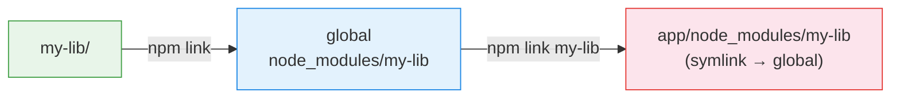
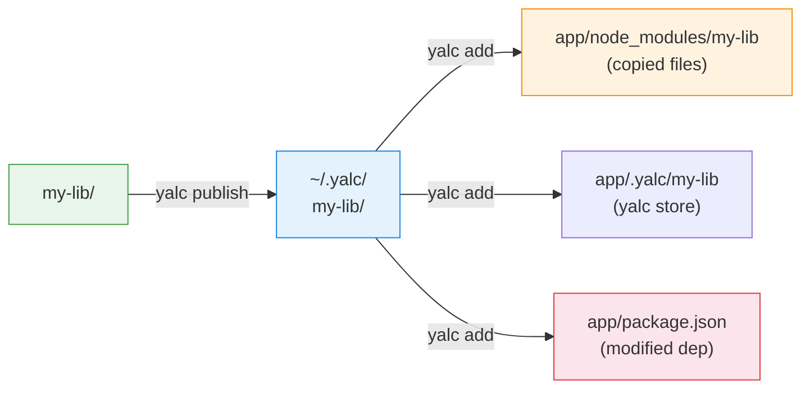
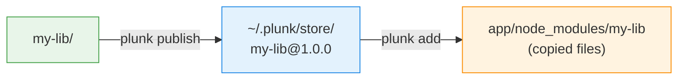

# npm link vs yalc vs plunk

You're developing a library and an app that uses it. You want changes to show up in the app without publishing to npm. Here's how the three main tools handle this, and where each breaks down.

## How they work

### npm link (symlinks)



Creates a symlink chain: library → global `node_modules` → consumer's `node_modules`. The catch is that Node.js resolves `require()` from the *real* path, not the link location.

### yalc (copy + package.json mutation)



Copies files but also rewrites the consumer's `package.json` to point to `.yalc/`. This shows up in `git diff`, CI might pick it up, and `npm publish` from the consumer could accidentally include the local override.

### plunk (copy only)



Copies files to a global store, then from the store into `node_modules/`. State is tracked in a gitignored `.plunk/` directory. Your `package.json` is never modified.

## Side by side

| | npm link | yalc | plunk |
|---|---|---|---|
| Module resolution | Broken (dual instances) | Works | Works |
| Git contamination | None | package.json + .yalc/ | None |
| Bundler HMR | Often broken | Fragile | Works |
| pnpm support | Fragile | Broken since v7.10 | Works |
| Watch mode | None | External (yalc-watch) | Built-in |
| Survives npm install | No | No | `plunk restore` |
| Lock file safe | Yes | Can corrupt | Never touches lockfiles |
| CI safe | Yes | Risk of leaking | Nothing in git |
| npm publish safe | Yes | Risk of leaking | Nothing in package.json |
| Transitive dep warnings | No | No | Yes |
| Incremental copy | N/A | Full copy each time | Hash-based diff |
| Backup/restore | No | No | Yes |
| Scoped packages | Works | Fragile | Works |

## Where things break

### Duplicate dependencies (npm link)

```mermaid
graph TB
    subgraph "npm link (broken)"
        App1[app] --> React1[react@18 ①]
        App1 --> Lib1["my-lib (symlink)"]
        Lib1 --> React2[react@18 ②]
    end

    subgraph "plunk (works)"
        App2[app] --> React3[react@18]
        App2 --> Lib2["my-lib (copied)"]
        Lib2 -.-> React3
    end

    style React1 fill:#fce4ec,stroke:#e53935
    style React2 fill:#fce4ec,stroke:#e53935
    style React3 fill:#e8f5e9,stroke:#43a047
```

With symlinks, `my-lib`'s `require('react')` resolves from the library's real location, which has its own `node_modules/react`. Now you have two React instances. Hooks fail silently, `instanceof` returns false, context doesn't propagate. It's one of those bugs where everything looks right but nothing works.

With plunk, `my-lib` is inside the consumer's `node_modules/`, so `require('react')` resolves to the same copy the app uses.

### Git contamination (yalc)

yalc modifies `package.json`:
```diff
 "dependencies": {
-  "my-lib": "^1.0.0"
+  "my-lib": "file:.yalc/my-lib"
 }
```

It also creates a `.yalc/my-lib/` directory. Forget to revert before committing and your team gets broken builds.

plunk keeps everything in `.plunk/` which is gitignored. Your `package.json` stays clean.

### pnpm (yalc + npm link)

pnpm uses a content-addressable store with symlinks to a `.pnpm/` virtual store. Neither `npm link` nor yalc understand this structure, and yalc has been broken with pnpm since v7.10.

plunk detects pnpm, follows the symlink chain into `.pnpm/`, and replaces files at the real directory. The existing symlink structure stays intact.

### Bundler HMR

| Scenario | npm link | yalc | plunk |
|---|---|---|---|
| Vite detects changes | No (symlink outside project) | Fragile (.yalc not watched) | Yes (files in node_modules) |
| Webpack re-builds | Sometimes | Sometimes | Yes |
| Turbopack | No (outside root) | Unknown | Yes |

plunk writes real files at `node_modules/` paths, which generates filesystem events bundlers can see. See [Bundler Guide](bundlers.md) for Vite config.

### Watch mode

| Tool | Watch support |
|---|---|
| npm link | None (manual re-link) |
| yalc | External package (yalc-watch), unmaintained |
| plunk | Built-in: `plunk push --watch --build "tsup"` |

plunk's watch mode handles the full loop: file change → debounce → build → publish → push. Build failures get logged but the watcher keeps running.

### After npm install

`npm install` wipes `node_modules/` overrides:

| Tool | After `npm install` |
|---|---|
| npm link | Symlinks gone, manual re-link |
| yalc | References gone, `yalc link` again |
| plunk | Run `plunk restore` (or automatic via postinstall hook) |

`plunk init` sets up a `postinstall` hook, so `plunk restore` runs automatically after every install.

## When to use what

`npm link` is fine for quick one-off tests where you just need to check if something works.

plunk is the better choice when you're doing ongoing development, using pnpm, working on a team (where git contamination matters), or testing in CI.

yalc still works if you can't install new tools or are on a very old Node version.
