# Getting started

## Install

```bash
pnpm add -g plunk

# or just use npx
npx plunk init
```

## The workflow

```mermaid
sequenceDiagram
    box rgb(200,230,201) Source
        participant Lib as Library
    end
    box rgb(187,222,251) Store
        participant Store as ~/.plunk/store
    end
    box rgb(255,236,179) Consumer
        participant App as App (node_modules)
    end

    Note over Lib: pnpm build
    Lib->>Store: plunk publish
    Store->>App: plunk add my-lib

    loop Watch mode
        Note over Lib: edit source
        Lib->>Lib: build (tsup, tsc, etc.)
        Lib->>Store: publish
        Store->>App: copy changed files
        Note over App: bundler detects changes → HMR
    end
```



## 1. Initialize your app

Run `plunk init` in any project that will consume local packages:

```bash
cd my-app
npx plunk init
```

This adds `.plunk/` to `.gitignore`, wires up a `postinstall` hook (`plunk restore || true`), and creates the `.plunk/` state directory. Safe to run multiple times.

## 2. Publish your library

In the library you're developing:

```bash
cd my-lib
pnpm build            # build your library first
plunk publish
```

plunk reads the `files` field from `package.json` (same as `npm pack`) and copies those files to `~/.plunk/store/my-lib@<version>/`. If nothing changed since last time, it skips.

## 3. Link into your app

```bash
cd my-app
plunk add my-lib
```

This copies files from the store into `node_modules/my-lib/`. plunk checks your lockfile to figure out the package manager and uses the right injection strategy (pnpm needs special handling for `.pnpm/`).

You can also publish and add in one step:

```bash
plunk add my-lib --from ../my-lib
```

## 4. Push changes

After making changes to your library:

```bash
cd my-lib
pnpm build
plunk push
```

This publishes to the store and copies changed files to every app that has `my-lib` linked. Only files that actually changed get re-copied.

## 5. Watch mode

Instead of manually rebuilding and pushing each time, use watch mode:

```bash
cd my-lib
plunk push --watch --build "pnpm build"
```


If a build fails, plunk logs the error and keeps watching. Fix the code, save again.

## 6. After `npm install`

Running `pnpm install` wipes `node_modules/` overrides. Get them back:

```bash
pnpm install       # links wiped
plunk restore      # all back
```

If you ran `plunk init`, this happens automatically via the `postinstall` hook.

## 7. Clean up

When you're done with local development:

```bash
plunk remove my-lib
```

This removes the plunk link and restores the original npm-installed version (if it was backed up).

## Try it for real

The [examples/](../examples/) folder has a working setup: two library packages, a Node.js consumer, and a React + Vite app with HMR. Good for kicking the tires.

## Next

- [Commands](commands.md) - every flag
- [How It Works](how-it-works.md) - store format, injection, copies
- [Bundler Guide](bundlers.md) - Vite, Webpack, esbuild setup
