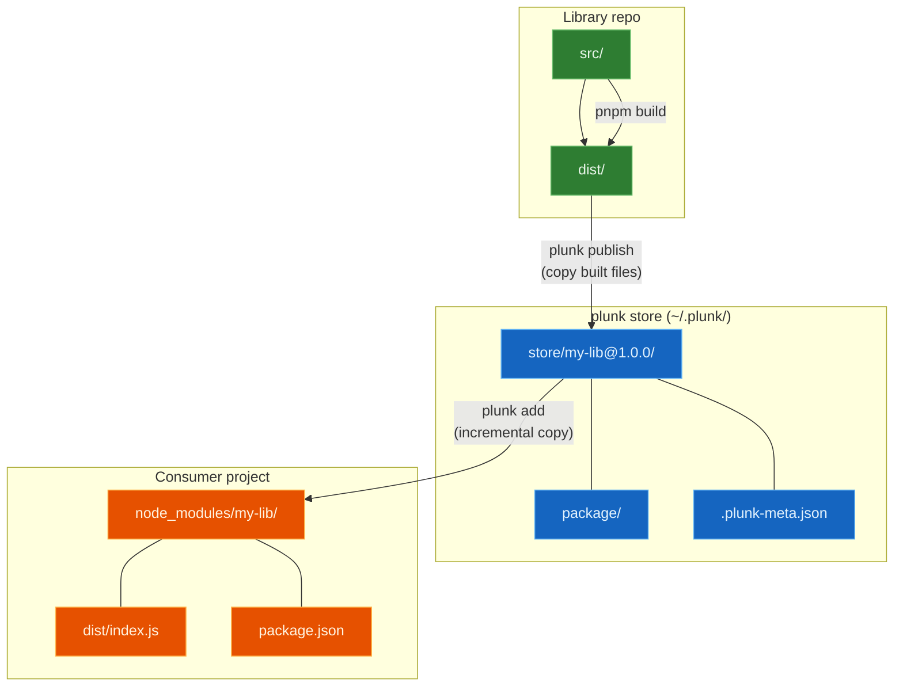
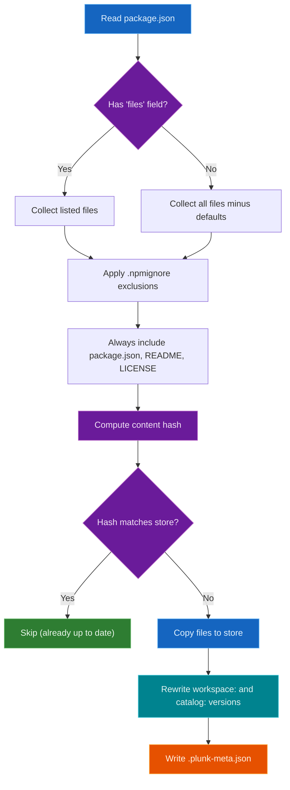
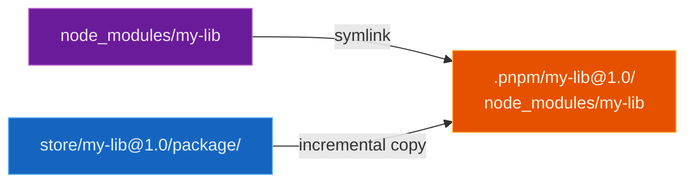
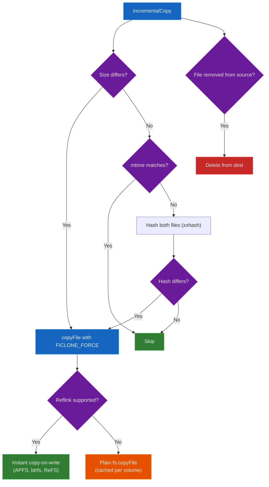

# How it works

plunk copies files. That's basically it. Publish copies your built library into a local store, and add/push copies from the store into `node_modules/`. No symlinks, no package.json rewrites.



## Store

The global store lives at `~/.plunk/` (override with `PLUNK_HOME` env var):

```
~/.plunk/
├── store/
│   ├── my-lib@1.0.0/
│   │   ├── package/              # Publishable files (same as npm pack)
│   │   │   ├── dist/index.js
│   │   │   ├── dist/index.d.ts
│   │   │   └── package.json
│   │   └── .plunk-meta.json      # Content hash, timestamp, source path
│   └── @scope+other-lib@2.3.1/   # Scoped: / encoded as +
│       └── ...
└── consumers.json                 # Which projects have linked which packages
```

A few things to note about the store:

- It's mutable, not content-addressed. `my-lib@1.0.0` is overwritten in-place when you re-publish. The content hash in `.plunk-meta.json` is just for skip detection ("has anything changed?").
- Scoped packages encode the `/` as `+` in directory names. `@scope/name` becomes `@scope+name`.
- `consumers.json` tracks which projects have linked which packages, so `plunk push` knows where to copy.

### `.plunk-meta.json`

```json
{
  "schemaVersion": 1,
  "contentHash": "sha256v2:a1b2c3d4...",
  "publishedAt": "2026-02-17T10:30:00.000Z",
  "sourcePath": "/home/user/projects/my-lib",
  "buildId": "a1b2c3d4"
}
```

## What happens during publish



File resolution follows `npm pack` rules:
- If `package.json` has a `files` array, only those files/globs are included
- Otherwise, all files minus `.git/`, `node_modules/`, etc.
- `.npmignore` exclusions always apply
- `package.json`, `README*`, `LICENSE*`, `CHANGELOG*` are always included

If a dependency uses `workspace:*` (or `workspace:^`, `workspace:~`), plunk rewrites it to the actual version in the store copy. The `catalog:` protocol (pnpm's shared version definitions in `pnpm-workspace.yaml`) is also resolved — both `catalog:` (default catalog) and `catalog:<name>` (named catalog) specifiers get replaced with the actual version string. Your source `package.json` is never touched.

When `publishConfig.directory` is set in `package.json`, plunk reads files from that subdirectory instead of the package root. This matches how npm/pnpm handle `publishConfig.directory` at pack time.

## Injection

plunk checks your lockfile to figure out the package manager, then uses the right copy strategy.

### npm / yarn / bun

Straightforward. Replace files in `node_modules/<pkg>/`:


Clear the target directory, copy files from the store. The writes generate filesystem events that bundler watchers pick up.

### pnpm

pnpm's `.pnpm/` virtual store makes this trickier. plunk follows the symlink chain to find the real directory:



plunk resolves `node_modules/<pkg>` → follows the symlink into `.pnpm/` → replaces files at the real directory. The top-level symlink is preserved.

### Detection

| Lockfile | Package manager |
|---|---|
| `pnpm-lock.yaml` | pnpm |
| `bun.lockb` or `bun.lock` | bun |
| `yarn.lock` | yarn |
| `package-lock.json` | npm |

Detection checks in priority order (pnpm > bun > yarn > npm). Falls back to npm if no lockfile is found.

#### Yarn Berry `nodeLinker` modes

When yarn is detected, plunk also reads `.yarnrc.yml` to determine the linker mode:

| `nodeLinker` value | Behavior |
|---|---|
| `node-modules` | Flat `node_modules/` — same as npm, works directly |
| `pnpm` | `.pnpm/` virtual store with symlinks — plunk follows the symlink chain (same as pnpm) |
| `pnp` | No `node_modules/` — incompatible, plunk exits with an error |
| *(absent, `.yarnrc.yml` exists)* | Berry defaults to PnP — plunk exits with an error |
| *(no `.yarnrc.yml`)* | Yarn Classic — flat `node_modules/`, works directly |

## Copies



1. Each `copyFile` first probes for CoW reflink support (`COPYFILE_FICLONE_FORCE`) on the target volume. The result is cached per volume root — if reflinks aren't supported (ext4, NTFS), all subsequent copies on that volume go straight to a plain `copyFile` with no wasted syscalls. On APFS (macOS), btrfs (Linux), and ReFS (Windows), the reflink is instant and uses no additional disk space.
2. Before copying, plunk runs a three-tier check: (a) compare file sizes — different sizes mean different content, copy immediately; (b) compare mtimes — if size and mtime both match, skip without hashing (plunk preserves source mtime on the destination after each copy, so matching mtime+size guarantees identical content); (c) hash both files using xxHash64 — only reached when size matches but mtime differs. Files over 1 MB use xxHash64 streaming to avoid loading them into memory. Only changed files get copied, and files removed from the source get deleted from the destination. All file comparisons run in parallel, throttled to the CPU core count.
3. Files are written directly to their final path in `node_modules/`, which generates the filesystem events bundler watchers need.

## State

Each consumer project gets a `.plunk/state.json` (gitignored):

```json
{
  "version": "1",
  "links": {
    "my-lib": {
      "version": "1.0.0",
      "contentHash": "sha256v2:abc123...",
      "linkedAt": "2026-02-17T10:30:00Z",
      "sourcePath": "/home/user/my-lib",
      "backupExists": true,
      "packageManager": "npm",
      "buildId": "abc12345"
    }
  }
}
```

Backups live in `.plunk/backups/<pkg>/`. That's the original npm-installed version, which gets restored when you run `plunk remove`.

The global registry at `~/.plunk/consumers.json` maps packages to projects:

```json
{
  "my-lib": ["/home/user/app-1", "/home/user/app-2"],
  "@scope/other-lib": ["/home/user/app-1"]
}
```

This lets `plunk push` know which projects to update.

## Hash strategy

plunk uses two different hash algorithms for different purposes:

| Hash | Algorithm | Where | Why |
|---|---|---|---|
| Per-file | xxHash64 (xxhash-wasm) | Incremental copy — comparing source vs destination files | Fast change detection. ~5-10x faster than SHA-256. Not persisted. |
| Aggregate | SHA-256 | `contentHash` in `.plunk-meta.json` and `state.json` | Content identity across publishes. Deterministic, stable prefix `sha256v2:`. |

The per-file hash is computed on every copy operation to decide which files actually changed. Small files (<=1 MB) are buffered and hashed in one shot. Large files use xxHash64 streaming to avoid loading them into memory.

The aggregate hash is computed once per publish over all files (sorted by path, length-prefixed). It uses SHA-256 because the `sha256v2:` prefix is stored in metadata, and switching algorithms would invalidate every existing store entry for no meaningful speedup.

The `buildId` is the first 8 hex characters of the content hash (after the `sha256v2:` prefix). It appears in logs and state files as a short identifier for each publish.

## Lifecycle hooks

When you run `plunk publish` (or push/dev, which call publish internally), plunk runs lifecycle scripts from `package.json` in this order:

```
preplunk → prepack → [publish files] → postpack → postplunk
```

- `preplunk` and `postplunk` always run if defined in `scripts`
- `prepack` and `postpack` can be skipped with `--no-scripts`
- Each hook has a 30-second timeout by default. Override with `PLUNK_HOOK_TIMEOUT` (milliseconds):
  ```bash
  PLUNK_HOOK_TIMEOUT=60000 plunk publish
  ```
- Hooks run in the package directory with `stdio: inherit`, so their output is visible

## Atomic publish

Publishing uses a two-phase write to prevent partial state:

1. Files are copied to a temporary directory (`<store-entry>.tmp-<timestamp>`)
2. The temp directory is atomically renamed to the final store path
3. If the store entry already existed, the old copy is renamed aside first, then deleted after the swap succeeds

A file lock (`withFileLock()`, using `mkdir` as an atomic lock primitive) prevents concurrent publishes of the same package from corrupting the store. The lock uses exponential backoff with stale detection — locks older than 60 seconds are considered abandoned and broken.

## Bin links

If a package has a `bin` field in `package.json`, plunk creates executables in `node_modules/.bin/`: symlinks on Unix, `.cmd` wrappers on Windows. Cleaned up on `plunk remove`.

## Why not symlinks?

See [Comparison](comparison.md) for the full picture, but the short version:

Node.js resolves `require()` from the symlink's *real* path, not the link path. So a library and its consumer can end up with two different copies of React, and you get cryptic runtime errors ("Invalid hook call", `instanceof` returning false). Bundlers like Vite and Turbopack also scope their file watching to the project directory, so a symlink pointing outside doesn't trigger HMR.

pnpm's "injected dependencies" feature already proved that copies work for this. plunk follows the same idea.

## Why not hardlinks?

Hardlinks sound perfect (instant, zero disk space) but they don't work here:

1. **Breaks incremental copy.** plunk compares source and destination file hashes to detect changes. Hardlinks share an inode, so modifying the source silently modifies the destination too — the hashes always match, and plunk never detects that anything changed.
2. **Breaks bundler watchers.** On macOS (FSEvents) and Windows (ReadDirectoryChangesW), modifying a file through one hardlink path does NOT notify watchers on a different path. Bundlers watching `node_modules/` would never see changes made via the store.
3. **Corrupts the store.** When `npm install` removes `node_modules/<pkg>/` containing hardlinks, it deletes the shared inodes. This corrupts the store and breaks every other consumer.
4. **Bundler caching.** Even if hardlinks worked perfectly, bundlers like Vite pre-bundle and cache deps, so they wouldn't re-read the files anyway.
