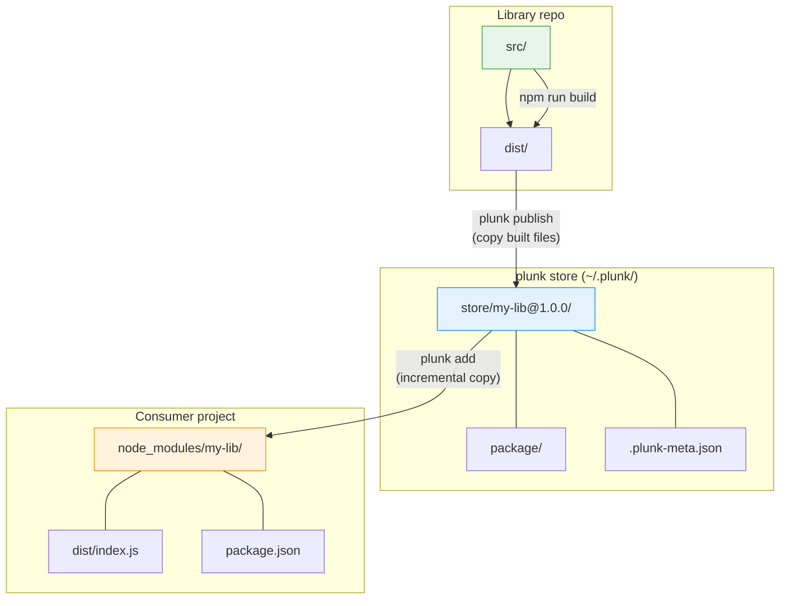
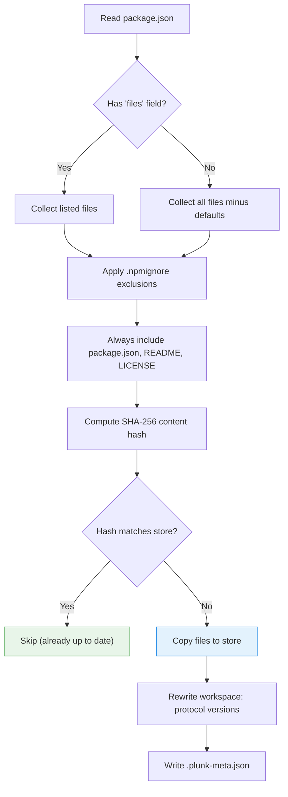
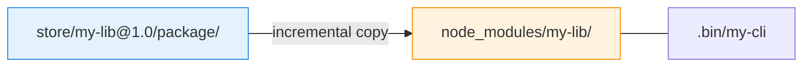
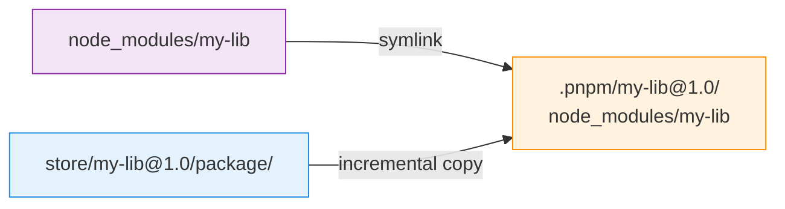
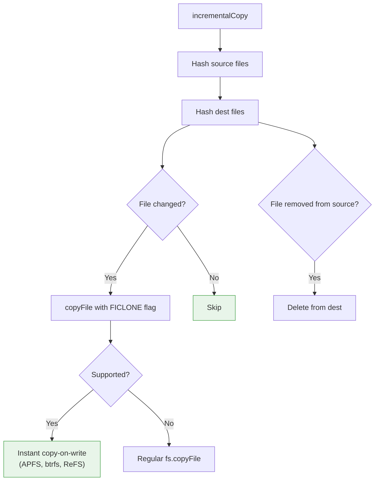

# How it works

plunk copies files. That's basically it. Publish copies your built library into a local store, and add/push copies from the store into `node_modules/`. No symlinks, no package.json rewrites.



## Store

The global store lives at `~/.plunk/` (override with `PLUNK_HOME` env var):

```
~/.plunk/
├── store/
│   ├── my-lib@1.0.0/
│   │   ├── package/              # Publishable files (same as npm pack)
│   │   │   ├── dist/index.js
│   │   │   ├── dist/index.d.ts
│   │   │   └── package.json
│   │   └── .plunk-meta.json      # Content hash, timestamp, source path
│   └── @scope+other-lib@2.3.1/   # Scoped: / encoded as +
│       └── ...
└── consumers.json                 # Which projects have linked which packages
```

A few things to note about the store:

- It's mutable, not content-addressed. `my-lib@1.0.0` is overwritten in-place when you re-publish. The content hash in `.plunk-meta.json` is just for skip detection ("has anything changed?").
- Scoped packages encode the `/` as `+` in directory names. `@scope/name` becomes `@scope+name`.
- `consumers.json` tracks which projects have linked which packages, so `plunk push` knows where to copy.

### `.plunk-meta.json`

```json
{
  "contentHash": "sha256:a1b2c3d4...",
  "publishedAt": "2026-02-17T10:30:00.000Z",
  "sourcePath": "/home/user/projects/my-lib"
}
```

## What happens during publish



File resolution follows `npm pack` rules:
- If `package.json` has a `files` array, only those files/globs are included
- Otherwise, all files minus `.git/`, `node_modules/`, etc.
- `.npmignore` exclusions always apply
- `package.json`, `README*`, `LICENSE*`, `CHANGELOG*` are always included

If a dependency uses `workspace:*` (or `workspace:^`, `workspace:~`), plunk rewrites it to the actual version in the store copy. Your source `package.json` is never touched.

## Injection

plunk checks your lockfile to figure out the package manager, then uses the right copy strategy.

### npm / yarn / bun

Straightforward. Replace files in `node_modules/<pkg>/`:



Clear the target directory, copy files from the store. The writes generate filesystem events that bundler watchers pick up.

### pnpm

pnpm's `.pnpm/` virtual store makes this trickier. plunk follows the symlink chain to find the real directory:



plunk resolves `node_modules/<pkg>` → follows the symlink into `.pnpm/` → replaces files at the real directory. The top-level symlink is preserved.

### Detection

| Lockfile | Package manager |
|---|---|
| `pnpm-lock.yaml` | pnpm |
| `bun.lockb` or `bun.lock` | bun |
| `yarn.lock` | yarn |
| `package-lock.json` | npm |

Detection checks in priority order (pnpm > bun > yarn > npm). Falls back to npm if no lockfile is found.

## Copies



1. Each `copyFile` call uses `COPYFILE_FICLONE`, which is instant on APFS (macOS), btrfs (Linux), and ReFS (Windows). On other filesystems it falls back to a regular copy.
2. Before copying, plunk hashes both source and destination files (SHA-256). Only changed files get copied, and files removed from the source get deleted from the destination.
3. Files are written directly to their final path in `node_modules/`, which generates the filesystem events bundler watchers need.

## State

Each consumer project gets a `.plunk/state.json` (gitignored):

```json
{
  "version": "1",
  "links": {
    "my-lib": {
      "version": "1.0.0",
      "contentHash": "sha256:abc123...",
      "linkedAt": "2026-02-17T10:30:00Z",
      "sourcePath": "/home/user/my-lib",
      "backupExists": true,
      "packageManager": "npm"
    }
  }
}
```

Backups live in `.plunk/backups/<pkg>/`. That's the original npm-installed version, which gets restored when you run `plunk remove`.

The global registry at `~/.plunk/consumers.json` maps packages to projects:

```json
{
  "my-lib": ["/home/user/app-1", "/home/user/app-2"],
  "@scope/other-lib": ["/home/user/app-1"]
}
```

This lets `plunk push` know which projects to update.

## Bin links

If a package has a `bin` field in `package.json`, plunk creates executables in `node_modules/.bin/`: symlinks on Unix, `.cmd` wrappers on Windows. Cleaned up on `plunk remove`.

## Why not symlinks?

See [Comparison](comparison.md) for the full picture, but the short version:

Node.js resolves `require()` from the symlink's *real* path, not the link path. So a library and its consumer can end up with two different copies of React, and you get cryptic runtime errors ("Invalid hook call", `instanceof` returning false). Bundlers like Vite and Turbopack also scope their file watching to the project directory, so a symlink pointing outside doesn't trigger HMR.

pnpm's "injected dependencies" feature already proved that copies work for this. plunk follows the same idea.

## Why not hardlinks?

Hardlinks sound perfect (instant, zero disk space) but they don't work here:

1. On macOS (FSEvents) and Windows (ReadDirectoryChangesW), modifying a file through one hardlink path does NOT notify watchers on a different path. Bundlers watching `node_modules/` would never see changes made via the store.
2. When `npm install` removes `node_modules/<pkg>/` containing hardlinks, it deletes the shared inodes. This corrupts the store and breaks every other consumer.
3. Even if hardlinks worked perfectly, bundlers like Vite pre-bundle and cache deps, so they wouldn't re-read the files anyway.
